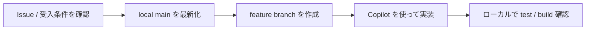
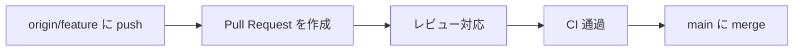

# 日常開発の全体フローマップ

## フェーズ別に見る

### 1. ローカルで進める



### 2. 共有して統合する



## 対応するコマンド例

```powershell
git pull origin main
git switch -c feature/my-task
git add .
git commit -m "Describe change"
git push origin feature/my-task
```

- `git pull origin main`: 作業前に `main` を最新化する
- `git switch -c feature/my-task`: 新しい作業 branch を作る
- `git add .` / `git commit -m "..."`: 変更を記録する
- `git push origin feature/my-task`: PR 用に remote へ送る

## ポイント

- `Issue` で目的を確認してから branch を切ると、変更範囲がぶれにくくなります。
- `Copilot` は実装補助と説明整理に役立ちますが、品質判定は `review` と `CI` が担います。
- `local` → `remote` → `PR` → `main` の流れで見ると、1 サイクルを把握しやすくなります。
