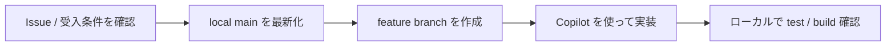
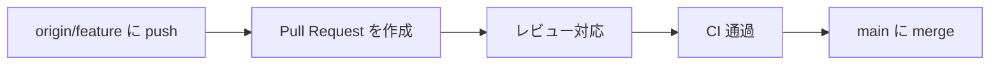

# 日常開発の全体フローマップ

## 典型シナリオ

新しい Issue に着手するとき、どのステップを踏んで PR までたどり着くかを俯瞰する場面です。

## コンセプトと仕組み

- `Issue → branch → 実装 → commit → PR → merge` の流れを一本の線として把握すること
- 各ステップでの目的を明確にすることで、作業の手戻りを減らせること
- Copilot は実装補助と説明整理に役立つが、品質判定はレビューと CI が担うこと

## 基本手順

1. Issue の受入条件を確認すること
2. `main` を最新化してから feature branch を作成すること
3. Copilot を活用しながら実装を進めること
4. ローカルでテスト・ビルドを確認すること
5. commit / push して PR を作成すること
6. レビュー対応後に CI が通ったことを確認して merge すること

## フェーズ別に見る

### 1. ローカルで進める



### 2. 共有して統合する



## コマンドと引数の意味

```powershell
git pull origin main
git switch -c feature/my-task
git add .
git commit -m "Describe change"
git push origin feature/my-task
```

- `git pull origin main`: 作業前に `main` を最新化すること
- `git switch -c feature/my-task`: 新しい作業 branch を作ること
- `git add .` / `git commit -m "..."`: 変更を記録すること
- `git push origin feature/my-task`: PR 用に remote へ送ること

## Copilot の使いどころ

- 「この Issue の作業ステップを整理してください」
- 「PR 説明文の下書きを作成してください」
- 「このフローのどこでリスクが高いか説明してください」

## 注意点

- `main` を最新化せずに branch を切らないこと
- CI が赤いまま merge しないこと
- 各ステップの目的を確認してから次に進むこと

## 章末チェック

- `Issue → PR → merge` の全ステップを説明できること
- 各フェーズで使うコマンドを手順通りに実行できること
- Copilot を活用するタイミングを判断できること
