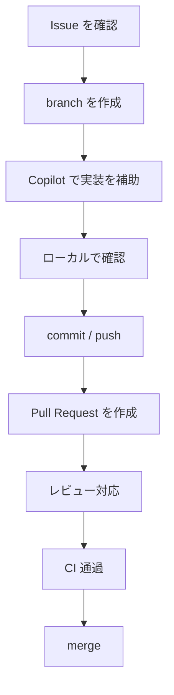

# 日常開発の全体フローマップ

## 1本の流れで見る

```mermaid
flowchart TD
    A[Issue を確認] --> B[branch を作成]
    B --> C[Copilot で実装を補助]
    C --> D[ローカルで確認]
    D --> E[commit / push]
    E --> F[Pull Request を作成]
    F --> G[レビュー対応]
    G --> H[CI 通過]
    H --> I[merge]
```

## ポイント

- `Copilot` は実装、説明、テスト観点で支援役になる
- 最終判断は人が行う
- `PR` と `CI` が品質ゲートになる
