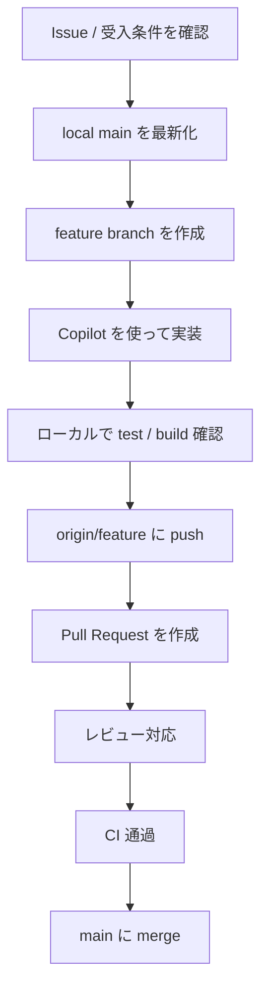

# 日常開発の全体フローマップ

## 1本の流れで見る

## ポイント

- `Issue` で目的を確認してから branch を切ると、変更範囲がぶれにくくなります。
- `Copilot` は実装補助と説明整理に役立ちますが、品質判定は `review` と `CI` が担います。
- `local` → `remote` → `PR` → `main` の流れで見ると、1 サイクルを把握しやすくなります。
