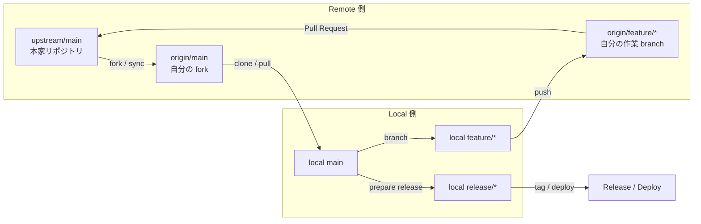

# fork / upstream の関係を図で理解する

## 全体関係図

## この図で押さえること

- `upstream` は本家、`origin` は自分の `remote`、`local` は手元の作業環境です。
- 日常開発では `local main` を最新化してから `feature branch` を切り、`origin` に push して `Pull Request` を出します。
- `release` は `main` を起点に分けて考えると、通常開発と運用フローを整理しやすくなります。
