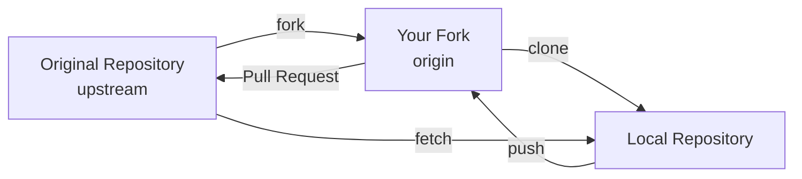

# fork / upstream の関係を図で理解する

```mermaid
flowchart LR
    A[Original Repository<br/>upstream] -->|fork| B[Your Fork<br/>origin]
    B -->|clone| C[Local Repository]
    A -->|fetch| C
    C -->|push| B
    B -->|Pull Request| A
```

## 読み方

- 本家は `upstream`
- 自分の fork は `origin`
- ローカルでは両方を意識して同期する
