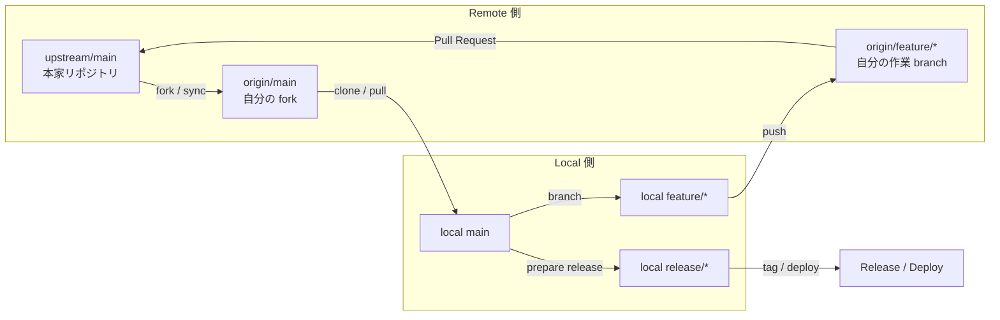

# fork / upstream の関係を図で理解する

## 典型シナリオ

`fork` ベースの協業フローが頭の中で整理できないとき、全体の関係図を参照して理解するケースです。

## コンセプトと仕組み

- `upstream` は本家、`origin` は自分の `remote`、`local` は手元の作業環境です。
- 日常開発では `local main` を最新化してから `feature branch` を切り、`origin` に push して `Pull Request` を出します。
- `release` は `main` を起点に分けて考えると、通常開発と運用フローの整理が容易になります。

## 基本手順

1. 全体関係図で `upstream` / `origin` / `local` の位置関係を把握すること
2. `upstream` から `origin` への同期フローを確認すること
3. `local feature/*` から `origin` 経由での PR 提出フローを理解すること

## 全体関係図

## Copilot の使いどころ

- 図の各矢印が表す操作の意味の説明
- 自分の現在地（どのステップにいるか）の確認
- フロー全体の中で不明な操作の解説依頼

> **Copilot へのプロンプト例**
>
> 「この図の `fork / sync` の矢印が示す git コマンドを説明してください」

## 注意点

- `upstream` へ直接 push しないこと（権限がある場合でも Pull Request を経由すること）
- `origin/main` と `local main` がずれると PR 差分の読み違えが起きること
- release ブランチは通常の feature 開発とは別フローで管理すること

## 章末チェック

- [ ] `upstream` / `origin` / `local` の 3 つの役割を説明できる
- [ ] 全体図の各矢印に対応する git コマンドを答えられる
- [ ] PR を出すまでの一連のフローを図なしで説明できる
- [ ] release ブランチの扱いが feature ブランチと異なる理由を理解していること
