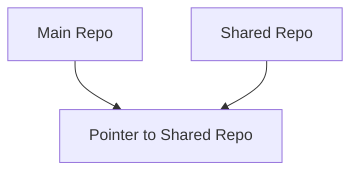
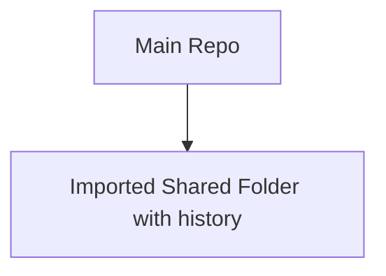

# submodule / subtree の見え方を図で整理する

## `submodule`

```mermaid
flowchart TD
    A[Main Repo] --> B[Pointer to Shared Repo]
    C[Shared Repo] --> B
```

## `subtree`

```mermaid
flowchart TD
    A[Main Repo] --> B[Imported Shared Folder with history]
```

## 実務上の違い

- `submodule` は参照先が独立している感覚が強い
- `subtree` は取り込み側で完結しやすい
