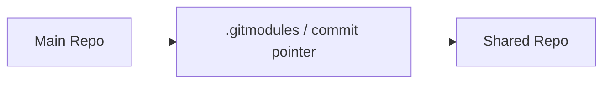
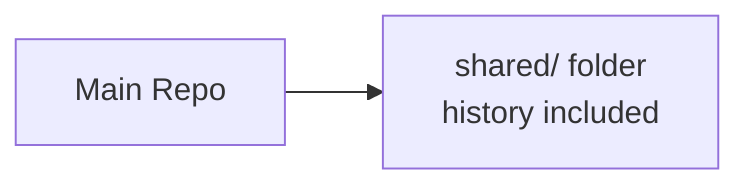

# submodule / subtree の見え方を図で整理する

## 典型シナリオ

`submodule` と `subtree` の違いをチームに説明したい、またはどちらを採用するか視覚的に整理したい場面です。
図を使って構成イメージを把握することで、判断の共有がしやすくなります。

## コンセプトと仕組み

- `submodule` は **外部 repo を参照ポインタとして持つ** 構成であること
- `subtree` は **外部 repo の内容を子フォルダーに取り込む** 構成であること
- どちらも共有資産の再利用を目的とするが、リポジトリ上の見え方が異なること
- 図で整理することでチームの認識合わせがしやすくなること

### `submodule` の構成イメージ

### `subtree` の構成イメージ

## 実務上の違い

- `submodule` は **外部 repo を参照** するため、共有元を独立して管理しやすいこと
- `subtree` は **利用側 repo に取り込む** ため、clone や日常操作が分かりやすいこと
- 独立管理を優先するなら `submodule`、扱いやすさを優先するなら `subtree` が向くこと
- どちらを選んでも構成図をチームで共有しておくと認識合わせがしやすくなること

## 基本手順

1. 共有したい資産と対象 repo の関係を図として描き出すこと
2. `submodule` 型（外部参照）か `subtree` 型（取り込み）かを判断すること
3. 選んだ方式の構成図をチーム内で共有すること
4. 図をドキュメントに貼り付けてオンボーディング資料にすること
5. 構成変更時には図も合わせて更新すること

## Copilot の使いどころ

- 構成図の Mermaid 記法への変換
- 図の説明文の生成
- チーム向け説明文のたたき台作成

> Copilot に「この構成を Mermaid 図で表してください」と依頼すると、flowchart や sequenceDiagram を素早く作成できます。

## 注意点

- `submodule` は参照先 repo が消えると機能しなくなること
- `subtree` の取り込みフォルダーは通常のファイルと見分けがつかないこと
- 図は実際の構成と乖離しないよう定期的に更新すること
- オンボーディング用として図を整備しておくと新規メンバーへの説明が楽になること

## 章末チェック

- `submodule` と `subtree` の構成上の違いを図を使って説明できること
- Mermaid 記法で簡単な構成図を書けること
- どちらの方式かを見分ける手がかりを挙げられること
