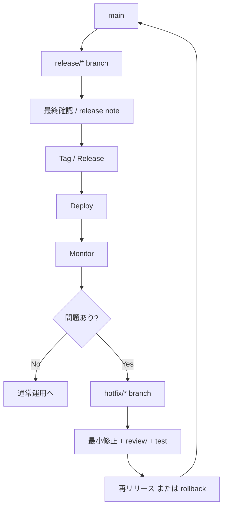

# release / hotfix の流れを図で見る

## 全体フロー

```mermaid
flowchart TD
    A[main] --> B[release/* branch]
    B --> C[最終確認 / release note]
    C --> D[Tag / Release]
    D --> E[Deploy]
    E --> F[Monitor]
    F --> G{問題あり?}
    G -- No --> H[通常運用へ]
    G -- Yes --> I[hotfix/* branch]
    I --> J[最小修正 + review + test]
    J --> K[再リリース または rollback]
    K --> A
```

## ポイント

- `release` は計画的な公開、`hotfix` は障害時の緊急修正として分けて考えます。
- どちらも最終的には `main` に反映し、記録を残すことが重要です。
- 速度を上げても `review`、`test`、`rollback` 判断は省略しないのが実務上の基本です。
