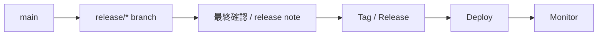
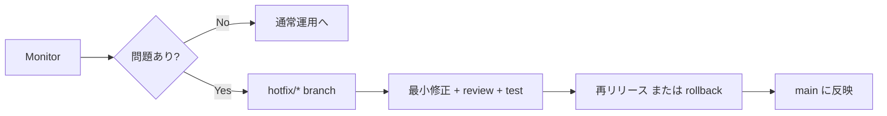

# release / hotfix の流れを図で見る

## 概要

release / hotfix / rollback の各フローを図で示したビジュアルガイドです。
通常リリースと緊急対応の違いを視覚的に把握できます。

## フェーズ別フロー

### 1. 通常 release の流れ

### 2. 問題発生時の hotfix

## ポイント

- `release` を計画的な公開、`hotfix` を障害時の緊急修正として区別した運用
- いずれも最終的に `main` へ反映し記録を残すことの重要性
- 速度を上げても `review`・`test`・`rollback` 判断を省略しない実務上の原則

## 図の読み方

- 箱はブランチまたは作業フェーズを示すノード
- 矢印による `push`・`deploy`・`merge` などの操作の流れの表現
- 左から右への読み進め方によるリリースから監視までの流れの把握
- `{問題あり?}` の分岐による通常運用と hotfix 対応の切り分け

## 関連ページ

- [release の準備](02-preparing-a-release.md)
- [hotfix ワークフロー](03-hotfix-workflow.md)
- [ロールバックとリリース後確認](04-rollback-and-post-release-checks.md)
