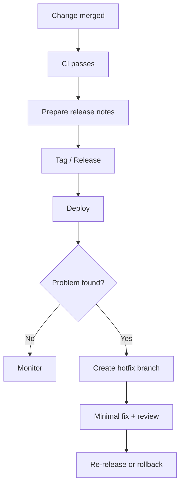

# release / hotfix の流れを図で見る

```mermaid
flowchart TD
    A[Change merged] --> B[CI passes]
    B --> C[Prepare release notes]
    C --> D[Tag / Release]
    D --> E[Deploy]
    E --> F{Problem found?}
    F -- No --> G[Monitor]
    F -- Yes --> H[Create hotfix branch]
    H --> I[Minimal fix + review]
    I --> J[Re-release or rollback]
```

## ポイント

- release と hotfix は別シナリオとして考える
- どちらも記録と共有が重要
