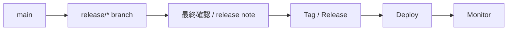
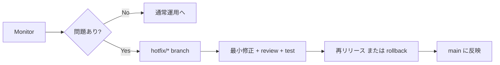

# release / hotfix の流れを図で見る

## 概要

release / hotfix / rollback の各フローを図で示したビジュアルガイドです。
通常リリースと緊急対応の違いを視覚的に把握できます。

## フェーズ別フロー

### 1. 通常 release の流れ

```powershell
# このセクションはフロー図の説明です
```



### 2. 問題発生時の hotfix



## ポイント

- `release` は計画的な公開、`hotfix` は障害時の緊急修正として分けて考えます。
- どちらも最終的には `main` に反映し、記録を残すことが重要です。
- 速度を上げても `review`、`test`、`rollback` 判断は省略しないのが実務上の基本です。

## 図の読み方

- 箱はブランチまたは作業フェーズを表します。
- 矢印は `push`、`deploy`、`merge` などの操作の流れを表します。
- 左から右に読むと、リリースから監視までの流れを追いやすくなります。
- `{問題あり?}` の分岐で、通常運用と hotfix 対応が分かれます。

## 関連ページ

- [release の準備](02-preparing-a-release.md)
- [hotfix ワークフロー](03-hotfix-workflow.md)
- [ロールバックとリリース後確認](04-rollback-and-post-release-checks.md)
