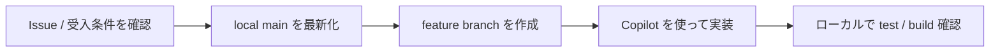
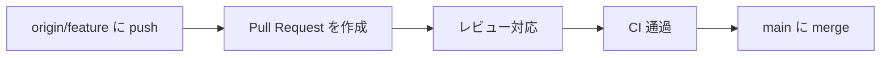
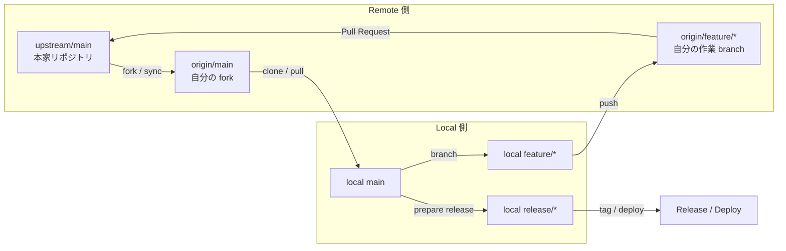
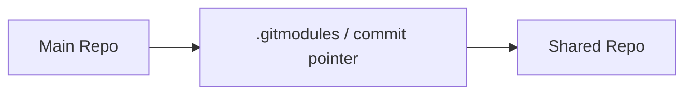
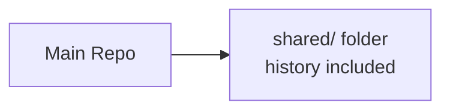
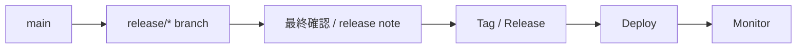
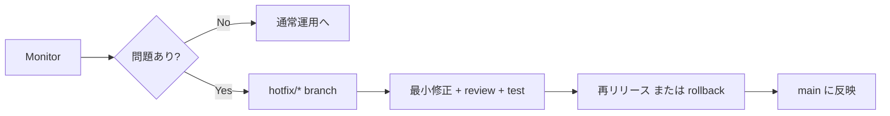

# GitHub + GitHub Copilot

## 実務ワークフローチュートリアル

GitHub と GitHub Copilot を使った日常開発から協業、共有資産管理、`release / hotfix` までを、
**実務シナリオ**に沿って学ぶ日本語教材です。

> 💡 ブラウザで https://duwenji.github.io/spa-quiz-app/ を開くと、関連トピックをクイズ形式で復習できます。

- 著者: 杜 文吉
- 対象: 開発者 / Tech Lead / リポジトリ管理者
- テーマ: `Issue` / `Pull Request` / `submodule` / `release`

### この教材で学べること
- `Issue → Branch → PR → Review → Merge` の基本フロー
- `fork` / `upstream` を使った協業パターン
- `submodule` / `subtree` による共有資産管理
- `release` / `hotfix` とチーム標準化

# 1. はじめに・オンボーディング

## 1.1 この教材の範囲と進め方

### 1.1.1 典型シナリオ

この教材を初めて開いたとき、どこから読み始めればよいかを把握する場面です。
自分の業務で頻出するシナリオを特定して、最短で実務に活かすルートを選びます。
チームで教材を共有するときに、各自の役割に合った読み進め方を提案する場面でも役立ちます。

### 1.1.2 コンセプトと仕組み

- この教材は機能の説明ではなく「実務シナリオ」を単位として構成されていること
- 各章は独立して読めるが、01 → 02 → 03 の順に進めると学習効果が高いこと
- `07-reference-and-scenario-playbook` は逆引きリファレンスとして活用できること
- Copilot は各章の内容を要約・整理する用途にも活用できること

### 1.1.3 基本手順

1. この章（01）でセットアップを済ませること
2. `02-daily-development-workflows` で基本の流れをつかむこと
3. `03`〜`06` で実務の広がりと運用・標準化を学ぶこと
4. `07` のリファレンスを逆引きとして活用すること

### 1.1.4 この章の目的

この教材全体で扱う **実務シナリオ** と、どの順で読み進めればよいかを把握します。

### 1.1.5 扱うシナリオ

1. 既存リポジトリへの参加
2. 通常の機能追加
3. `fork` / `upstream` を使った協業
4. `submodule` / `subtree` を使った共有資産管理
5. release / hotfix / rollback
6. チーム標準化とガバナンス

### 1.1.6 この教材の読み方

- まずは `01-getting-started-and-onboarding` で `GitHub` / `VS Code` / `Copilot` の初期設定を済ませること
- 次に `02-daily-development-workflows` を通して基本の流れをつかむこと
- その後 `03-collaboration-patterns` と `04-shared-assets-and-multi-repo-management` で実務の広がりを学ぶこと
- 最後に `05` と `06` で運用・標準化まで確認すること

### 1.1.7 Copilot の使いどころ

- 「この教材の章一覧を見て、バックエンド開発者に関連する章を優先順位付きで教えてください」
- 「`02-daily-development-workflows` の内容をひとことで要約してください」
- 「この教材で扱う `submodule` と `subtree` の違いを 2 行で説明してください」

### 1.1.8 注意点

- 途中の章から始める場合は前提となるセットアップ（章 01）を確認すること
- GitHub / Copilot のバージョンによって UI や機能が異なる場合があること
- 教材内のコマンドは PowerShell で動作確認されていること

### 1.1.9 章末チェック

- 自分の業務で頻出するシナリオを 2〜3 個挙げられること
- GitHub と Copilot を「機能」ではなく「仕事の流れ」で捉えられること
- この教材の章構成と読み進め方を説明できること
- `07-reference-and-scenario-playbook` を逆引きとして活用する場面をイメージできること

## 1.2 GitHub と Copilot の初期セットアップ

### 1.2.1 典型シナリオ

チームに参加した初日、または新しいマシンで開発を始める際に環境を整える場面です。
`GitHub` アカウントと `Copilot` の利用権限がそろっているかを確認してセットアップを完了させます。

### 1.2.2 コンセプトと仕組み

- `GitHub` は認証とリポジトリ操作の基盤です。
- `VS Code` は `GitHub Copilot` / `Copilot Chat` 拡張を通じて、アカウントやライセンス状態と連携します。
- 組織利用では、個人設定だけでなく **ライセンス割り当て** や **利用ポリシー** が有効であることも重要です。
- つまり、`GitHub アカウント`、`VS Code`、`Copilot 利用権限` の 3 つがそろって初めてスムーズに使えます。

### 1.2.3 準備するもの

- `GitHub` アカウント
- `VS Code`
- `Git`
- `GitHub Copilot` のライセンスまたは利用可能な環境

### 1.2.4 基本手順

1. `VS Code` に GitHub 関連拡張を入れること
2. GitHub にサインインすること
3. `Copilot` と `Copilot Chat` を有効化すること
   - 拡張機能ビューで `GitHub Copilot` を検索してインストールすること
   - `GitHub Copilot Chat` を検索してインストールすること
   - 求められたら `GitHub` アカウントでサインインすること、業務で使うアカウントか確認すること
   - `Copilot Chat` パネルを開き、短い質問を送って応答が返ることを確認すること
   - 組織利用の場合は、ライセンスや利用ポリシーで無効化されていないか確認する
4. `git config` でユーザー名とメールアドレスを設定すること

```powershell
git config --global user.name "Your Name"
git config --global user.email "you@example.com"
```

### 1.2.5 コマンドと引数の意味

- `git config --global user.name "Your Name"`
  - `config`: Git の設定値を確認・変更する
  - `--global`: 現在のユーザー環境全体に適用する
  - `user.name`: commit 作成者名の設定キー
  - `"Your Name"`: 表示したい名前
- `git config --global user.email "you@example.com"`
  - `user.email`: commit 作成者メールアドレスの設定キー
  - `"you@example.com"`: GitHub と整合するメールアドレスを入れる

> 会社用アカウントと個人アカウントを使い分ける場合は、どのメールアドレスで commit が記録されるかを先に確認しておくと安全です。

### 1.2.6 実務上の確認ポイント

- 会社の GitHub 組織に参加済みか
- `GitHub Copilot` のライセンスや組織利用設定が有効か
- `VS Code` が正しい `GitHub` アカウントでサインインされているか
- 利用ポリシーに同意しているか
- 機密情報を入力してはいけないルールを理解しているか

### 1.2.7 つまずきやすい点

- `Copilot Chat` が表示されないときは、拡張が有効か、再サインインが必要ないかを確認すること
- ライセンスが見つからないときは、個人契約か組織割り当てかを確認すること
- 会社管理の環境では、管理者側で機能制限されている場合があること

### 1.2.8 Copilot の使いどころ

- 「このリポジトリの構成を要約してください」
- 「初回参加者が最初に確認すべき点を列挙してください」
- 「この Issue の前提知識を整理してください」

### 1.2.9 注意点

- 会社用アカウントと個人アカウントを混在させないこと
- 組織のライセンスや利用ポリシーを事前に確認すること
- `git config` のメールアドレスは GitHub アカウントと一致させること
- 機密情報を Copilot Chat に入力しないこと

### 1.2.10 章末チェック

- `VS Code` で `GitHub Copilot` と `Copilot Chat` が動作することを確認できること
- `git config --global user.name` と `user.email` が正しく設定されていること
- 所属する GitHub 組織に参加済みで、Copilot のライセンスが有効であることを確認できること

## 1.3 clone、origin、ローカルセットアップ

### 1.3.1 典型シナリオ

既存のリポジトリに参加した初日、ローカル環境を用意してすぐに作業を始めたい場面です。
`git clone` でリポジトリを取得し、`origin` の向き先を確認してから開発に着手します。

### 1.3.2 コンセプトと仕組み

- `git clone` するとリモートリポジトリの完全なコピーがローカルに作成されること
- clone 元のリモートは自動的に `origin` という名前で登録されること
- `git remote -v` で登録されたリモートの URL を確認できること
- ローカル環境では依存関係のインストールやビルド確認が必要な場合があること

### 1.3.3 基本手順

1. `git clone <repo-url>` でリポジトリをローカルへ複製すること
2. `cd <repo-name>` でリポジトリのディレクトリに移動すること
3. `git remote -v` で `origin` の URL が正しいことを確認すること
4. `README` や開発ルールを読んで依存関係のインストール手順を確認すること
5. `npm install` などの依存関係インストールを実行すること
6. ビルドとテストが通ることをローカルで確認すること

### 1.3.4 まず理解すること

`git clone` すると、通常は clone 元が `origin` として登録されます。

```powershell
git clone <repo-url>
cd <repo-name>
git remote -v
```

### 1.3.5 コマンドと引数の意味

- `git clone <repo-url>`
  - `clone`: repository をローカルへ複製する
  - `<repo-url>`: GitHub 上の clone 用 URL
- `cd <repo-name>`
  - `cd`: 作業ディレクトリを移動する
  - `<repo-name>`: clone 後に作成されたフォルダー名
- `git remote -v`
  - `remote`: 登録済みリモートを扱う
  - `-v`: URL を含めて詳しく表示する (`verbose`)

> `git clone` した直後は、clone 元が通常 `origin` として自動登録されます。まず `git remote -v` で向きを確認すると安心です。

### 1.3.6 初回に確認する項目

- 依存関係のインストール方法
- 開発サーバーやテストの起動方法
- ブランチ戦略
- PR のルール

### 1.3.7 Copilot の使いどころ

- `README` の要点要約
- セットアップ手順の見落としチェック
- 不明なスクリプトの意味確認

### 1.3.8 注意点

- `main` に直接 push しないこと
- 環境変数やシークレットを勝手に作らないこと
- まずローカルで `build` / `test` が通るか確認すること

### 1.3.9 章末チェック

- `git clone` した後に `git remote -v` で `origin` の URL を確認できること
- ローカルでビルドとテストが正常に通ることを確認できること
- ブランチ戦略と PR のルールを把握していること

## 1.4 既存リポジトリに参加した初日にやること

### 1.4.1 典型シナリオ

既存プロジェクトにアサインされた初日、何から手をつければよいかわからない場面です。
チームのルールと開発環境を把握し、最初のタスクに取り掛かれる状態を目指します。

### 1.4.2 コンセプトと仕組み

- 既存リポジトリには独自のブランチ戦略・レビュー文化・コーディング規約があること
- `copilot-instructions.md` があればチームの Copilot 利用ルールが定義されていること
- 初日の目標は「全部覚える」ことではなく、変更してよい範囲を把握することであること
- `npm test` / `npm run build` など品質確認の入口となるコマンドを先に把握すること

### 1.4.3 基本手順

1. `GitHub` / `VS Code` / `Copilot` の初期セットアップが完了していることを確認すること
2. `README` と開発ルールを読むこと
3. `Issue` 管理の流れを把握すること
4. `copilot-instructions.md` があれば内容を読むこと
5. `npm test` / `npm run build` など基本コマンドを確認してローカルで実行すること
6. レビュー文化とブランチ命名規則を確認すること

### 1.4.4 チェックリスト

- `GitHub` / `VS Code` / `Copilot` の初期セットアップが完了していることを確認すること
- `README` と開発ルールを読むこと
- `Issue` 管理の流れを把握すること
- `copilot-instructions.md` があるなら読むこと
- `npm test` / `npm run build` など基本コマンドを確認すること
- レビュー文化とブランチ命名規則を確認すること

### 1.4.5 最初に意味を把握したいコマンド

- `npm test`
  - `test`: `package.json` に定義されたテスト用 script を実行する
  - **確認したいこと:** 何のテストが動くか、失敗時の見方はどうか
- `npm run build`
  - `run`: 任意の script 名を実行する
  - `build`: build 用 script 名。プロジェクトにより内容は異なる
  - **確認したいこと:** どの成果物が作られるか、公開前に必須か

> 初日は「全部覚える」よりも、**どのコマンドが品質確認の入口か** を把握することを優先すると進めやすいです。

### 1.4.6 Copilot の使いどころ

- 「この repo の主なディレクトリの役割を説明してください」
- 「初日に押さえるべきルールを 5 つにまとめてください」
- 「この Issue を始める前提知識を要約してください」

### 1.4.7 注意点

- `main` ブランチに直接 push しないこと
- `copilot-instructions.md` のルールを無視しないこと
- ブランチ命名規則やコミットメッセージの形式をチームに合わせること
- 初日から大きな変更を加えず、まず既存のコードとルールを把握すること

### 1.4.8 章末チェック

- 何を変更してよくて、何を勝手に変えてはいけないかを理解していること
- ローカルで `npm test` と `npm run build` が正常に実行できること
- Issue 管理の流れとブランチ命名規則を把握していること

### 1.4.9 目標

初日で、**何を変更してよくて、何を勝手に変えてはいけないか** を理解することが重要です。

# 2. 日常の開発ワークフロー

## 2.1 Issue から branch を切るまで

### 2.1.1 典型シナリオ

チームの backlog から Issue を受け取り、作業ブランチを作って着手する場面です。

### 2.1.2 コンセプトと仕組み

- `Issue` は「何を直すか」「何を満たせば完了か」を共有する入口です。
- `branch` は本流の作業と切り離して、安全に変更を進めるための作業場所です。
- 先に目的を確認してから branch を切ることで、不要な実装や手戻りを減らせます。

### 2.1.3 基本手順

1. Issue の目的と受入条件を読むこと
2. 必要なら Copilot Chat で作業分解を相談すること
3. ローカルで最新を取り込むこと
4. 作業ブランチを作成すること

```powershell
git pull origin main
git switch -c feature/add-quiz-filter
```

### 2.1.4 コマンドと引数の意味

- `git pull origin main`
  - `pull`: remote の変更を取得し、現在 branch に反映すること
  - `origin`: ふだん自分が push する remote 名
  - `main`: 最新化の基準にする branch 名
- `git switch -c feature/add-quiz-filter`
  - `switch`: branch を切り替えること
  - `-c`: branch を新規作成すること
  - `feature/add-quiz-filter`: 作業内容が分かる branch 名

> branch を切る前に `main` を最新化しておくと、あとから不要な競合を減らしやすくなります。

### 2.1.5 Copilot の使いどころ

- 「この Issue の作業ステップを 5 つに分けてください」
- 「受入条件からテスト観点を整理してください」
- 「この変更で影響しそうなファイルを推測してください」

### 2.1.6 成果物

- 着手前メモ
- 作業ブランチ
- 変更対象の見通し

### 2.1.7 注意点

- Issue を読まずに実装を始めないこと
- ブランチ名はチーム規約に合わせること
- 受入条件が曖昧なら先に確認すること

### 2.1.8 章末チェック

- Issue から受入条件を読み取れること
- `git pull` で最新化してから branch を切れること
- branch 名に作業内容を反映できること

## 2.2 Copilot を使った実装の進め方

### 2.2.1 典型シナリオ

仕様がある程度決まっていて、実装を前に進めたい場面です。
既存コードの意図が分からない箇所の説明を求めたり、テストケースの洗い出しを依頼したりします。
Copilot と対話しながら、実装のもやもやを解消していくイメージです。

### 2.2.2 コンセプトと仕組み

- Copilot はコンテキスト（背景情報）を渡すほど精度が上がるツールであること
- ファイルを開いた状態や関連コードを選択した状態でプロンプトを送ると、より的確な提案が返ること
- 提案は「たたき台」であり、要件・セキュリティ・例外処理の確認は人間が担うこと
- プロジェクト固有のルールは `.github/copilot-instructions.md` に書くことで毎回説明する手間を省けること

### 2.2.3 基本手順

1. VS Code で変更対象のファイルを開くこと
2. 関連するコードを選択すること（任意）
3. Copilot Chat を開くこと（`Ctrl + Alt + I`）
4. 目的をプロンプトで伝えること
5. 提案を確認し、必要な部分を採用すること
6. ローカルでテストを実行して動作を確認すること

関連ファイルを複数開いておくと、Copilot がより広いコンテキストから提案を作れます。
またコード選択時は、機能単位で意図が明確な箇所を選ぶと効果的です。
一度に複数の変更を依頼するより、小さな単位でやり取りするほうが正確な提案が得られます。

### 2.2.4 Copilot の使いどころ

- 「`filterQuiz` 関数に、カテゴリが空の場合のバリデーションを追加してください」
- 「`fetchUserData` のユニットテストケースを網羅的に 5 件列挙してください」
- 「この `sortByPriority` 関数の処理の流れを 3 行で説明してください」
- 「選択中のコードをリファクタして、可読性を上げてください」

これらの使い方では、Copilot に「何のファイル」「何の関数」を扱うか明示することが大切です。

### 2.2.5 注意点

- 提案コードを要件と照らし合わせて確認すること
- セキュリティ上の懸念（入力バリデーション・認証処理）は必ず自分でレビューすること
- 提案をそのままコミットせず、ローカルでテストを実行してから採用すること
- Copilot の提案は最新の API や依存ライブラリのバージョンに追従していない場合があること
- チーム内でコード規約が決まっている場合は、それに合うよう手動で調整すること
- 提案の背景に何があるのか理解してから採用することが重要です
- エラーメッセージが出た場合は、Copilot にエラーの内容を伝えて修正を依頼することも効果的です
- すべての提案を鵜呑みにせず、チーム内でコードレビューの対象に含めることが推奨されます

### 2.2.6 効果的な使い方のポイント

- 既存コードの説明が必要な場合は、その関数やファイルを選択してから質問すること
- テストケース案をもらう場合は、想定される利用パターンを簡潔に説明すること
- リファクタリング依頼する場合は、「可読性」「パフォーマンス」など目的を明確にすること

### 2.2.7 章末チェック

- Copilot Chat を開いてプロンプトを送る操作ができること
- コンテキストを渡した場合と渡さない場合の提案の違いを体験できること
- 提案を採用する前に確認すべき 3 点（要件・セキュリティ・テスト）を挙げられること
- 実装中に不明な部分が出たときに Copilot に相談できること

## 2.3 commit と PR のベストプラクティス

### 2.3.1 典型シナリオ

機能追加の実装が終わり、変更を commit して PR を作成する場面です。
レビュアーが変更の意図をすぐ理解できるよう、commit メッセージと PR 説明文を整えます。

### 2.3.2 コンセプトと仕組み

- 1 commit = 1 つの意図にすることで、後から変更の経緯を追いやすくなること
- PR は「何を・なぜ・どう確認したか」を伝えるコミュニケーションツールであること
- CI が通った状態で PR を出すことで、レビュアーの負荷を下げられること

### 2.3.3 基本手順

1. 変更内容を `git status` で確認すること
2. 意図に合うファイルだけを `git add` で staging すること
3. 変更内容と理由が分かる commit メッセージを書くこと
4. PR 説明文に変更理由・変更内容・動作確認の 3 点を記載すること

```powershell
git add .
git commit -m "Add quiz filter to selector"
```

### 2.3.4 コマンドと引数の意味

- `git add .`
  - `add`: commit 対象として staging すること
  - `.`: 現在フォルダー以下の変更をまとめて対象にすること
- `git commit -m "Add quiz filter to selector"`
  - `commit`: staging 済み変更を履歴として記録すること
  - `-m`: commit message をその場で指定すること
  - `"Add quiz filter to selector"`: 変更内容を表すメッセージ

> まとめて `git add .` したときは、`git status` で意図しないファイルが入っていないか確認すると安全です。

### 2.3.5 PR に含める項目

PR 本文には以下の 4 点を含めます。

- 何を変えたか
- なぜ変えたか
- どう確認したか
- レビュアーに見てほしい点

### 2.3.6 Copilot の使いどころ

- 「PR 本文の下書きを作成してください」
- 「この変更の概要を要約してください」
- 「レビュー観点を洗い出してください」

### 2.3.7 注意点

- 大きすぎる PR は分割すること
- スクリーンショットや再現手順を必要に応じて添えること
- CI が赤いまま PR を出さないこと

### 2.3.8 章末チェック

- commit メッセージに変更内容と理由が含まれていることを確認できること
- PR 説明文に変更理由・変更内容・動作確認の 3 点が含まれていること
- 大きすぎる PR を分割するタイミングを判断できること

## 2.4 レビュー指摘への対応と fixup

### 2.4.1 典型シナリオ

PR を出した後に、レビュアーから修正依頼や質問を受ける場面です。

### 2.4.2 コンセプトと仕組み

- レビューコメントは「コードの改善提案」として受け取ることで、建設的な対話につながること
- fixup commit を使うことで、修正の経緯を履歴として残せること
- 修正後に関連テストを再実行することで、デグレードを早期に検知できること

### 2.4.3 基本手順

1. レビューコメントの意図を確認すること
2. 必要に応じて Copilot Chat で修正方針を整理すること
3. 修正を実装し、関連テストを再実行すること
4. fixup commit を作成して変更を記録すること
5. PR 上で修正内容を短くコメントで共有すること

```powershell
git add .
git commit -m "fixup: address review comment on validation logic"
git push origin feature/my-task
```

### 2.4.4 コマンドと引数の意味

- `git commit -m "fixup: ..."`: レビュー対応であることを commit メッセージで明示すること
- `git push origin feature/my-task`: 修正を remote に反映して CI を再実行させること

### 2.4.5 レビュー対応の判断基準

レビューコメントに対しては以下の観点で対応を判断します。

- 指摘が正しいと判断した場合: 修正して感謝を伝えること
- 指摘の意図が不明な場合: 質問して確認してから修正すること
- 意見が分かれる場合: 根拠を示して丁寧に議論すること

### 2.4.6 Copilot の使いどころ

- 「このレビューコメントの意図を要約してください」
- 「この指摘に対する修正方針を整理してください」
- 「この修正への返信文の下書きを作ってください」
- 「修正後のコードに問題がないか確認してください」

### 2.4.7 注意点

- 指摘を機械的に全部受けるのではなく、根拠を確認すること
- 修正コミットは分かりやすく残すこと
- 変更後は関連テストを再実行すること
- レビュー対応が長引く場合は早めに相談すること

### 2.4.8 章末チェック

- レビューコメントの意図を自分の言葉で説明できること
- fixup commit を使って修正履歴を残せること
- 修正後にテストを再実行して問題がないことを確認できること
- 反論が必要な場合に根拠を示して議論できること
- Copilot を使って返信文の下書きを作成できること

## 2.5 日常開発の全体フローマップ

### 2.5.1 典型シナリオ

新しい Issue に着手するとき、どのステップを踏んで PR までたどり着くかを俯瞰する場面です。

### 2.5.2 コンセプトと仕組み

- `Issue → branch → 実装 → commit → PR → merge` の流れを一本の線として把握すること
- 各ステップでの目的を明確にすることで、作業の手戻りを減らせること
- Copilot は実装補助と説明整理に役立つが、品質判定はレビューと CI が担うこと

### 2.5.3 基本手順

1. Issue の受入条件を確認すること
2. `main` を最新化してから feature branch を作成すること
3. Copilot を活用しながら実装を進めること
4. ローカルでテスト・ビルドを確認すること
5. commit / push して PR を作成すること
6. レビュー対応後に CI が通ったことを確認して merge すること

### 2.5.4 フェーズ別に見る

#### 2.5.4.1 1. ローカルで進める



#### 2.5.4.2 2. 共有して統合する



### 2.5.5 コマンドと引数の意味

```powershell
git pull origin main
git switch -c feature/my-task
git add .
git commit -m "Describe change"
git push origin feature/my-task
```

- `git pull origin main`: 作業前に `main` を最新化すること
- `git switch -c feature/my-task`: 新しい作業 branch を作ること
- `git add .` / `git commit -m "..."`: 変更を記録すること
- `git push origin feature/my-task`: PR 用に remote へ送ること

### 2.5.6 Copilot の使いどころ

- 「この Issue の作業ステップを整理してください」
- 「PR 説明文の下書きを作成してください」
- 「このフローのどこでリスクが高いか説明してください」

### 2.5.7 注意点

- `main` を最新化せずに branch を切らないこと
- CI が赤いまま merge しないこと
- 各ステップの目的を確認してから次に進むこと

### 2.5.8 章末チェック

- `Issue → PR → merge` の全ステップを説明できること
- 各フェーズで使うコマンドを手順通りに実行できること
- Copilot を活用するタイミングを判断できること

## 2.6 ハンズオン: Issue から PR までを一通り回す

### 2.6.1 典型シナリオ

`Issue → branch → 実装 → commit → PR` の一連の流れを、実際の repo を題材に体験する場面です。

### 2.6.2 コンセプトと仕組み

- ハンズオンでは小さい Issue を選ぶことで、1 サイクルを短時間で完了できること
- 受入条件を先にメモすることで、実装の方向性がぶれにくくなること
- Copilot に作業分解を依頼することで、実装ステップを見通しやすくなること

### 2.6.3 基本手順

1. 小さめの改善 Issue を 1 つ選ぶこと
2. 受入条件を 2〜3 行でメモすること
3. `Copilot Chat` に作業分解を依頼すること
4. branch を切って実装すること
5. 変更後にローカル確認を行うこと
6. commit / push / PR 作成まで進めること

```powershell
git switch -c feature/sample-improvement
```

### 2.6.4 コマンドと引数の意味

- `git switch -c feature/sample-improvement`
  - `switch`: branch を切り替えること
  - `-c`: 新しい branch を作成すること
  - `feature/sample-improvement`: 手を入れる内容が分かる branch 名

実装後の commit と push は以下の手順で行います。

```powershell
git add .
git commit -m "Improve sample feature"
git push origin feature/sample-improvement
```

> まずは小さめの改善 Issue を選び、branch 名にも目的が出るようにしておくと PR レビュー時に伝わりやすくなります。

### 2.6.5 Copilot の使いどころ

- 「この Issue を実装ステップに分けてください」
- 「PR 説明文の下書きを作ってください」
- 「レビューで見られそうな観点を列挙してください」

### 2.6.6 注意点

- 推奨題材は `spa-quiz-app` を使うこと
- 受入条件を確認してから実装を始めること
- PR 作成まで完了してから次の Issue に移ること

### 2.6.7 章末チェック

- PR を作成できること
- 変更理由と検証結果を説明できること
- `Issue → branch → commit → PR` の流れを自力で再現できること
- branch 名に作業目的を反映できること

# 3. 協業パターン

## 3.1 fork と upstream の基本

### 3.1.1 典型シナリオ

オープンソースプロジェクトや社内の共有リポジトリへ貢献するとき、直接 push する権限がなく、`fork` 経由で変更提案が必要なケースです。

### 3.1.2 コンセプトと仕組み

- `origin` は自分の作業結果を `push` する先、`upstream` は本家の更新を受け取る先です。
- この 2 つを分けることで、本家を直接触らずに安全な変更提案が可能です。
- 定期的に `upstream/main` を取り込むのは、自分の `fork` と本家の差分を小さく保つための習慣です。

### 3.1.3 基本手順

1. 本家リポジトリを GitHub 上で `fork` すること
2. ローカルに `clone` して `origin` を確認すること
3. 本家を `upstream` として追加すること
4. 定期的に `upstream/main` を取り込んで同期を保つこと

```powershell
git remote -v
git remote add upstream https://github.com/ORIGINAL_OWNER/REPO.git
git fetch upstream
```

### 3.1.4 コマンドと引数の意味

- `git remote -v`
  - `remote`: 登録済み remote の管理コマンド
  - `-v`: URL を含めた詳細表示オプション
- `git remote add upstream https://github.com/ORIGINAL_OWNER/REPO.git`
  - `add`: 新しい remote の登録
  - `upstream`: 本家 repo を表す慣例名
  - `https://github.com/ORIGINAL_OWNER/REPO.git`: 本家の clone URL
- `git fetch upstream`
  - `fetch`: 最新履歴の取得
  - `upstream`: 取得元 remote 名

> まず `git remote -v` で今の接続先を確認してから `upstream` を追加すると、push 先の取り違えを防ぐことができます。

### 3.1.5 Copilot の使いどころ

- `origin` と `upstream` の違いが混乱したときの整理
- コンフリクト解消前の影響範囲の整理
- PR に書く説明文の下書き作成

> **Copilot へのプロンプト例**
>
> 「`origin` と `upstream` の違いを図を使って説明してください」

### 3.1.6 注意点

- `upstream` を長期間放置すると差分が大きくなり、同期コストが増加すること
- 同期前後でテストやビルドの確認が必要なこと
- `push` 先を `origin` と `upstream` で間違えないように、`git remote -v` で確認すること

### 3.1.7 章末チェック

- [ ] `origin` と `upstream` の役割の違いを説明できること
- [ ] `git remote add upstream <URL>` で本家を登録できること
- [ ] `git fetch upstream` で本家の最新履歴を取得できること
- [ ] 定期同期の目的と重要性を理解していること

## 3.2 upstream と同期する

### 3.2.1 典型シナリオ

本家リポジトリが更新されたとき、自分の `fork` と `feature branch` に最新の変更を反映する必要があるケースです。

### 3.2.2 コンセプトと仕組み

- `upstream` 同期は、本家の最新状態を自分の作業環境へ取り込むための操作です。
- 差分が小さいうちに同期すると、`feature branch` へ反映するときのコンフリクトを減らせます。
- つまり、同期は「あとで困らないための予防作業」という位置付けです。

### 3.2.3 基本手順

1. `upstream` から最新履歴を取得すること
2. `main` ブランチへ切り替えること
3. 取得した `upstream/main` を現在のブランチへ統合すること
4. 自分の `origin` へ push して fork を最新化すること

```powershell
git fetch upstream
git switch main
git merge upstream/main
git push origin main
```

### 3.2.4 コマンドと引数の意味

- `git fetch upstream`
  - `fetch`: 最新履歴の取得（現在のブランチへの反映は行わない）
  - `upstream`: 本家 repository の remote 名
- `git switch main`
  - `switch`: ブランチの切り替え
  - `main`: 同期の基点にするブランチ名
- `git merge upstream/main`
  - `merge`: 取得済みの変更を現在のブランチへの統合
  - `upstream/main`: `upstream` 上の `main` ブランチの参照
- `git push origin main`
  - `origin`: 自分の fork / clone 先の remote 名
  - `main`: 更新を送り返す自分側のブランチ名

> 重要なのは `fetch` と `merge` を分けて考えることです。`fetch` は取得のみ、`merge` で初めて現在のブランチへ反映されます。

### 3.2.5 Copilot の使いどころ

- 同期手順の確認や見直し
- コンフリクト解消方針の整理
- merge 後のテスト観点の洗い出し

> **Copilot へのプロンプト例**
>
> 「upstream/main を merge した後に確認すべきテスト観点を列挙してください」

### 3.2.6 注意点

- `fetch` と `merge` を混同しないこと（`pull` は両方を一度に行う）
- 大きな差分になる前にこまめに同期すること
- `merge` 後は必ずビルドとテストの確認を行うこと

### 3.2.7 章末チェック

- [ ] `git fetch` と `git pull` の違いを説明できること
- [ ] `upstream/main` を `local main` へ統合する手順を実行できること
- [ ] 同期後に自分の fork を更新する意味を理解していること
- [ ] コンフリクトが発生したときの対応方針を説明できること

## 3.3 merge と rebase の実務的な使い分け

### 3.3.1 典型シナリオ

`feature branch` の変更を `main` へ取り込む際、`merge` と `rebase` のどちらを使うか判断が必要なケースです。

### 3.3.2 コンセプトと仕組み

- `merge` は分岐した履歴をそのまま統合する考え方です。
- `rebase` は自分の変更を最新の土台に載せ直して、履歴を整理する考え方です。
- つまり、**共有履歴の安全性を優先するか、履歴の見通しを優先するか** で使い分けます。

### 3.3.3 基本手順

1. 現在の `main` ブランチを最新化すること
2. `feature branch` へ切り替えること
3. チームの規約に従い `merge` または `rebase` を選択すること
4. コンフリクトがあれば解消してからコミットすること

```powershell
git merge upstream/main
git rebase main
```

### 3.3.4 コマンドと引数の意味

- `git merge upstream/main`
  - `merge`: 別系統の履歴を現在ブランチへの統合
  - `upstream/main`: 取り込み元ブランチの参照
- `git rebase main`
  - `rebase`: 現在の変更を `main` の先頭への載せ直し
  - `main`: 新しい土台にしたいブランチ名

> `rebase` は履歴がきれいになる一方で、共有済みブランチでは扱いに注意が必要です。迷う場合はチーム標準への準拠が安全です。

### 3.3.5 Copilot の使いどころ

- 差分の意味の要約
- rebase 後に確認すべきポイントの整理
- チームへの説明文の下書き作成

> **Copilot へのプロンプト例**
>
> 「merge と rebase の違いをチームメンバー向けに分かりやすく説明してください」

### 3.3.6 注意点

- 公開済みブランチへの `rebase` はチームの作業に影響すること
- `rebase` 後は `git push --force-with-lease` が必要になる場合があること
- どちらを使っても最終的なビルドとテストの確認が必要なこと

### 3.3.7 章末チェック

- [ ] `merge` と `rebase` の履歴への影響の違いを説明できること
- [ ] チーム規約に従った使い分けの判断ができること
- [ ] 共有ブランチへの `rebase` のリスクを理解していること
- [ ] コンフリクト発生時の解消手順を実行できること
- [ ] `git push --force-with-lease` が必要な状況を判断できること
- [ ] merge コミットと rebase 後の履歴の見た目の違いを説明できること
- [ ] `git log --oneline --graph` で履歴を視覚的に確認できること

## 3.4 conflict を Copilot と解消する

### 3.4.1 典型シナリオ

`merge` や `rebase` の途中でコンフリクトが発生したとき、変更意図を確認しながら解消が必要なケースです。

### 3.4.2 コンセプトと仕組み

- conflict は、同じ行や近い範囲に対して複数の変更が入ったときに発生します。
- 重要なのは「どちらを残すか」ではなく、**両方の変更意図を理解して正しく統合すること** です。
- `Copilot` は差分の意味整理には役立ちますが、最終判断は人が行う必要があります。

### 3.4.3 基本手順

1. コンフリクトが発生しているファイルの確認をすること
2. 両方の変更意図の理解をすること
3. Copilot に差分の意味を説明させること
4. 人が最終判断して解消すること
5. 解消済みファイルをステージングしてコミットすること

```powershell
git status
git add <resolved-file>
git commit
```

### 3.4.4 コマンドと引数の意味

- `git status`
  - conflict 中のファイルの一覧表示
- `git add <resolved-file>`
  - `<resolved-file>`: 解消が終わったファイルパス
  - 解消完了を Git へ通知するための操作
- `git commit`
  - conflict 解消結果のコミットとしての確定

### 3.4.5 Copilot の使いどころ

- 2 つの変更の差分の要約と意味の説明
- 安全な統合案の候補の提示
- 解消後の確認観点の洗い出し

> **Copilot へのプロンプト例**
>
> 「この 2 つの変更の違いを要約してください」
>
> 「どの統合案が安全か候補を出してください」

### 3.4.6 注意点

- Copilot に最終判断を丸投げしないこと
- コンフリクト解消後は必ずビルドとテストの実行をすること
- マーカー (`<<<<<<<`, `=======`, `>>>>>>>`) が残っていないかの確認を行うこと

### 3.4.7 章末チェック

- [ ] `git status` でコンフリクト中のファイルを確認できること
- [ ] Copilot を使った差分の意味整理の手順を実行できること
- [ ] コンフリクト解消後の確認観点を説明できること
- [ ] 解消完了を Git へ通知する操作を理解していること

## 3.5 fork / upstream の関係を図で理解する

### 3.5.1 典型シナリオ

`fork` ベースの協業フローが頭の中で整理できないとき、全体の関係図を参照して理解するケースです。

### 3.5.2 コンセプトと仕組み

- `upstream` は本家、`origin` は自分の `remote`、`local` は手元の作業環境です。
- 日常開発では `local main` を最新化してから `feature branch` を切り、`origin` に push して `Pull Request` を出します。
- `release` は `main` を起点に分けて考えると、通常開発と運用フローの整理が容易になります。

### 3.5.3 基本手順

1. 全体関係図で `upstream` / `origin` / `local` の位置関係を把握すること
2. `upstream` から `origin` への同期フローを確認すること
3. `local feature/*` から `origin` 経由での PR 提出フローを理解すること

### 3.5.4 全体関係図



### 3.5.5 Copilot の使いどころ

- 図の各矢印が表す操作の意味の説明
- 自分の現在地（どのステップにいるか）の確認
- フロー全体の中で不明な操作の解説依頼

> **Copilot へのプロンプト例**
>
> 「この図の `fork / sync` の矢印が示す git コマンドを説明してください」

### 3.5.6 注意点

- `upstream` へ直接 push しないこと（権限がある場合でも Pull Request を経由すること）
- `origin/main` と `local main` がずれると PR 差分の読み違えが起きること
- release ブランチは通常の feature 開発とは別フローで管理すること

### 3.5.7 章末チェック

- [ ] `upstream` / `origin` / `local` の 3 つの役割を説明できること
- [ ] 全体図の各矢印に対応する git コマンドを答えられること
- [ ] PR を出すまでの一連のフローを図なしで説明できること
- [ ] release ブランチの扱いが feature ブランチと異なる理由を理解していること

## 3.6 協業チェックリスト

### 3.6.1 概要

Fork / upstream を使った協業の各ステップで確認すべき項目のチェックリストです。

### 3.6.2 fork / upstream 運用

- [ ] `origin` と `upstream` の役割を確認したこと
- [ ] 本家との差分を最新化したこと
- [ ] 同期後に build / test の確認を行ったこと

### 3.6.3 PR 作成前

- [ ] 変更理由の説明ができること
- [ ] レビュー観点の整理が完了していること
- [ ] コンフリクトがないことの確認が完了していること

### 3.6.4 コンフリクト解消

- [ ] コンフリクトが発生しているファイルの確認が完了していること
- [ ] 両方の変更意図の把握が完了していること
- [ ] 解消後のビルドとテストの実行が完了していること

### 3.6.5 マージ / リベース方針

- [ ] チームの `merge` / `rebase` 規約を確認したこと
- [ ] 共有ブランチへの `rebase` を避けていること

### 3.6.6 関連ページ

- [fork と upstream の基本](01-fork-and-upstream-basics.md)
- [upstream との同期](02-syncing-with-upstream.md)
- [ハンズオン: fork / upstream 同期](07-hands-on-lab-fork-sync.md)

## 3.7 ハンズオン: fork / upstream 同期を試す

### 3.7.1 典型シナリオ

本家リポジトリへの貢献を始めるとき、`fork` と `upstream` の設定から PR 提出までの一連の操作を習得するケースです。

### 3.7.2 コンセプトと仕組み

- `fork` ベースの協業では、`origin`（自分の fork）と `upstream`（本家）の 2 つの remote を管理します。
- `upstream` から取得した変更を `local main` へ反映し、その後 `origin` へ push することで fork を最新化できます。
- これらの操作を習慣化することで、コンフリクトの発生を最小限に抑えられます。

### 3.7.3 基本手順

1. 対象リポジトリを GitHub 上で `fork` すること
2. ローカルに `clone` すること
3. `upstream` を追加すること
4. 本家との差分を `fetch` / `merge` すること
5. 自分の fork に `push` して PR を作ること

```powershell
git remote add upstream https://github.com/ORIGINAL_OWNER/REPO.git
git fetch upstream
git merge upstream/main
```

### 3.7.4 コマンドと引数の意味

- `git remote add upstream https://github.com/ORIGINAL_OWNER/REPO.git`
  - `add`: remote の登録
  - `upstream`: 本家 repo の慣例名
  - `https://github.com/ORIGINAL_OWNER/REPO.git`: 本家 URL
- `git fetch upstream`
  - `fetch`: 最新履歴の取得
  - `upstream`: 取得元 remote 名
- `git merge upstream/main`
  - `merge`: 取得した履歴を現在ブランチへの反映
  - `upstream/main`: 本家 `main` の参照先

> `fetch` と `merge` を分けて実行すると、「取得だけした状態」で差分確認が容易になります。

### 3.7.5 Copilot の使いどころ

- 手順の確認や次のステップの案内
- コンフリクト発生時の解消方針の整理
- PR 説明文の下書き作成

> **Copilot へのプロンプト例**
>
> 「upstream/main を merge した後に確認すべきポイントを教えてください」

### 3.7.6 注意点

- `upstream` を追加する前に `git remote -v` で現在の設定の確認が必要なこと
- `merge` の前に必ず `git switch main` でブランチの切り替えをすること
- PR を出す前にコンフリクトがないことの確認が必要なこと

### 3.7.7 章末チェック

- [ ] `origin` と `upstream` の役割の違いを説明できること
- [ ] 本家追従の最小フローを再現できること
- [ ] `fetch` と `merge` を分けて実行する意味を理解していること
- [ ] PR 提出前に確認すべき項目を列挙できること

# 4. 共有資産とマルチリポジトリ管理

## 4.1 submodule を使うべき場面

### 4.1.1 典型シナリオ

複数のリポジトリで共通ライブラリや共有テンプレートを使いたいとき、
管理方法として `submodule` を検討する場面です。
共有物の履歴を独立したまま参照し続けたい場合に特に有効です。

`submodule` が向いているケースの例：

- 共通テンプレートや shared docs を別 repo として独立管理したい場面
- 複数プロジェクトで使う内部ライブラリのバージョンを repo ごとに固定したい場面
- upstream 側の更新を段階的・明示的に取り込みたい場面

### 4.1.2 コンセプトと仕組み

- `submodule` は外部リポジトリを **参照ポインタ** として取り込む仕組みであること
- `.gitmodules` ファイルに URL とパスが記録されること
- 親 repo は submodule の特定コミットを固定して参照すること
- 更新を取り込むには明示的な操作が必要であること

### 4.1.3 基本手順

1. `git submodule add <url> <path>` で外部 repo を追加すること
2. `.gitmodules` と追加されたフォルダーをステージしてコミットすること
3. 別環境で clone した後、`git submodule update --init --recursive` を実行すること
4. 共有元の更新を取り込む場合は `git submodule update --remote` を実行すること
5. 更新内容を確認してから親 repo にコミットすること

### 4.1.4 コマンドと引数の意味

```powershell
git submodule update --init --recursive
git submodule add <url> <path>
```

- `git submodule update --init --recursive`
  - `update`: 登録済み submodule を現在の指定 revision に合わせる操作
  - `--init`: 未初期化の submodule の初期化
  - `--recursive`: 入れ子になった submodule もまとめて処理する指定

- `git submodule add <url> <path>`
  - `add`: 新しい submodule の登録
  - `<url>`: 追加する外部リポジトリの URL
  - `<path>`: 配置先ディレクトリのパス

### 4.1.5 Copilot の使いどころ

- `submodule` 更新手順の説明作成
- `.gitmodules` の読み解き
- 更新時のレビュー観点整理

> GitHub Copilot Chat に「.gitmodules の内容を説明してください」と貼り付けると、構成の把握が早くなります。

### 4.1.6 注意点

- clone 時に `--recursive` を忘れると submodule が空になること
- 更新方法をチームで統一しないと混乱しやすいこと
- 初学者には操作が分かりにくい場合があること
- `submodule update` のタイミングをルール化しておくこと

### 4.1.7 章末チェック

- `submodule` が向いているケースを 2 つ挙げられること
- `git submodule update --init --recursive` の各引数の意味を説明できること
- `submodule` と `subtree` の違いを 1 文で説明できること

## 4.2 subtree を使うべき場面

### 4.2.1 典型シナリオ

チームメンバーに `submodule` の追加学習をさせずに、共有資産を別リポジトリから取り込みたい場面です。
共有物を子フォルダーとして自分の repo に含めながら、通常の Git 操作で扱える点が利点です。

`subtree` が向いているケースの例：

- テンプレートやスクリプト群を別 repo から子フォルダーとして取り込みたい場面
- 利用側メンバーに `submodule` の追加学習をさせたくない場面
- clone 後に特別な操作なしで共有資産を使い始めたい場面

### 4.2.2 コンセプトと仕組み

- `subtree` は外部リポジトリの内容を **自分の repo の一部として取り込む** 方式であること
- 利用側は通常の Git 操作に近い感覚で扱えること
- clone が単純で、追加ツールなしで扱えること
- 取り込み後は通常のコミット履歴に混ざる形で管理されること

### 4.2.3 基本手順

1. 共有元リモートを `git remote add SHARED_REMOTE <url>` で登録すること
2. `git subtree add --prefix=shared-assets SHARED_REMOTE main --squash` で取り込むこと
3. 取り込み後の内容をコミット履歴で確認すること
4. 共有元の更新を取り込む場合は `git subtree pull --prefix=shared-assets SHARED_REMOTE main --squash` を実行すること
5. 競合が発生した場合は内容を確認してから解消すること

### 4.2.4 コマンドと引数の意味

```powershell
git subtree add --prefix=shared-assets SHARED_REMOTE main --squash
git subtree pull --prefix=shared-assets SHARED_REMOTE main --squash
```

- `git subtree add --prefix=shared-assets SHARED_REMOTE main --squash`
  - `subtree add`: 別リポジトリの内容を現在 repo 配下へ取り込む操作
  - `--prefix=shared-assets`: 取り込み先フォルダーの指定
  - `SHARED_REMOTE`: 共有元リモート名
  - `main`: 取り込む共有元ブランチ名
  - `--squash`: 履歴を 1 つのまとまりとして取り込む指定

- `git subtree pull --prefix=shared-assets SHARED_REMOTE main --squash`
  - `subtree pull`: 共有元の最新を取り込む更新操作
  - `--prefix`: 対象フォルダーの指定
  - `--squash`: 履歴をまとめる指定

### 4.2.5 Copilot の使いどころ

- `subtree` の初回取り込みコマンドの生成
- `prefix` 設計のアドバイス取得
- 更新フローのドキュメント作成

> Copilot に「subtree を使った共有資産の更新手順を説明してください」と依頼すると、チーム向けの手順書のたたき台になります。

### 4.2.6 注意点

- 更新の流れを理解していないと差分管理が難しいこと
- 共有元との同期方針を先に決めておくこと
- `prefix` に取り込む内容と場所を明確にしておくこと
- `--squash` を使わないと共有元の全履歴が混入すること

### 4.2.7 章末チェック

- `subtree` が `submodule` より扱いやすいケースを説明できること
- `git subtree add` の各引数の意味を説明できること
- 共有元の更新を `subtree pull` で取り込む手順を実行できること

## 4.3 submodule vs subtree 判断ガイド

### 4.3.1 典型シナリオ

共有資産を複数リポジトリで使い始めるにあたり、`submodule` と `subtree` のどちらを採用するか判断が必要な場面です。
チームの規模や運用負荷を踏まえて、適切な方式を選ぶことが重要です。

判断が求められる具体的な例：

- 新しいプロジェクトに既存の shared skills を取り込む場面
- チームが新たに組成され、共有資産管理の方針を決める場面
- 現行の方式に問題が生じて見直しが必要な場面

### 4.3.2 コンセプトと仕組み

- `submodule` は **外部 repo を参照する** 考え方であること
- `subtree` は **履歴ごと取り込む** 考え方であること
- 判断の軸は、**履歴の独立性**・**利用側の単純さ**・**チーム運用負荷** の 3 つであること
- 技術的な優劣だけでなく、チームにとって定着しやすいかどうかで選ぶのが実務的であること

| 観点 | `submodule` | `subtree` |
|---|---|---|
| 履歴の独立性 | 高い | 取り込み側に混ざる |
| clone の簡単さ | やや難しい | 比較的簡単 |
| 更新の明示性 | 明確 | 運用次第 |
| 初学者への分かりやすさ | 低め | 高め |

### 4.3.3 基本手順

1. 共有したい資産の種類と更新頻度を整理すること
2. 利用側チームメンバーの Git 習熟度を確認すること
3. 履歴の独立性と運用の単純さのどちらを優先するか決めること
4. 選択した方式の導入手順をチームで共有すること
5. 更新フローと担当者をルール化すること

### 4.3.4 ざっくりした選び方

- 共有物を **独立 repo のまま厳密に管理したい** → `submodule`
- 利用側の運用を **できるだけ単純にしたい** → `subtree`
- チームの Git 習熟度が低い → `subtree` を検討すること
- 複数の consumer repo で異なるバージョンを使いたい → `submodule` を検討すること

### 4.3.5 Copilot の使いどころ

- 判断基準の比較表の作成
- 選定理由のドキュメント化
- チーム向け説明文のたたき台作成

> Copilot Chat に「私たちの状況（チームの規模、更新頻度など）を伝えた上で、submodule と subtree のどちらが向きますか」と聞くと、具体的な判断材料が得られます。

### 4.3.6 注意点

- どちらが常に正しいわけではなく、**組織の運用負荷** で決めること
- 導入後に方式を変更するとコストが大きくなること
- 選定後は更新フローをドキュメント化しておくこと
- チーム全員が更新手順を理解できる状態にしておくこと

### 4.3.7 章末チェック

- `submodule` と `subtree` の履歴管理の違いを説明できること
- チームの状況に応じてどちらが適切かを判断できること
- 判断の観点（独立性・単純さ・運用負荷）を挙げられること

## 4.4 shared templates / skills を複数 repo で管理する

### 4.4.1 典型シナリオ

複数のリポジトリで共通のテンプレート、スクリプト、ドキュメント、skills を再利用したい場面です。
中央で一元管理しながら、各 repo が必要なタイミングで取り込む仕組みを整えます。

### 4.4.2 コンセプトと仕組み

- 共有資産管理の本質は、**一元更新のしやすさ** と **利用側の扱いやすさ** のバランスであること
- 更新頻度が高いほど中央管理の価値が上がること
- 利用者が多いほど運用の単純さが重要になること
- 技術選定は「どの方法が強いか」よりも「どの方法がチームに定着しやすいか」で考えること

### 4.4.3 基本手順

1. 共有したい資産を 1 つの repo（または決めたフォルダー）に集約すること
2. 管理方式（`submodule`・`subtree`・コピー・package）を選定すること
3. 各 consumer repo への導入手順をドキュメント化すること
4. 更新時の通知フローと担当者を決めること
5. 定期的に共有資産を見直してメンテナンスすること

### 4.4.4 代表的な選択肢と判断の観点

管理方式を選ぶ際には次の観点で整理すること：

- 更新頻度（高いほど中央管理の価値が増すこと）
- 利用側の分かりやすさ（利用者が多いほど運用の単純さが重要になること）
- バージョン固定の必要性（固定が必要なら `submodule` が向くこと）
- 管理者の運用負荷（複雑になるほどドキュメント化が必要になること）

### 4.4.5 コマンドと引数の意味

```powershell
git submodule add <url> <path>
git subtree add --prefix=<path> <remote> <branch> --squash
```

- `git submodule add <url> <path>`
  - `add`: 共有 repo を submodule として登録する操作
  - `<url>`: 共有リポジトリの URL
  - `<path>`: 配置先のパス指定

- `git subtree add --prefix=<path> <remote> <branch> --squash`
  - `add`: 共有内容の取り込み操作
  - `--prefix`: 配置先フォルダーの指定
  - `--squash`: 履歴をまとめる指定

### 4.4.6 Copilot の使いどころ

- 選定理由の文書化
- 導入手順のたたき台作成
- 更新フローのチェックリスト化

> Copilot に「shared templates を submodule で管理するためのセットアップ手順を書いてください」と依頼すると、手順書のたたき台が素早く得られます。

### 4.4.7 注意点

- 管理方式を途中で変更するとコストが大きいこと
- 共有資産に repo 固有の設定を混ぜないこと
- 更新者と利用者の役割を明確に分けておくこと
- 利用側での変更が共有元に意図せず影響しないよう設計すること

### 4.4.8 章末チェック

- 共有資産の管理方式を選定する判断軸を説明できること
- `submodule`・`subtree`・コピー運用の違いを挙げられること
- 更新フローをドキュメント化して共有できること

## 4.5 submodule / subtree の見え方を図で整理する

### 4.5.1 典型シナリオ

`submodule` と `subtree` の違いをチームに説明したい、またはどちらを採用するか視覚的に整理したい場面です。
図を使って構成イメージを把握することで、判断の共有がしやすくなります。

### 4.5.2 コンセプトと仕組み

- `submodule` は **外部 repo を参照ポインタとして持つ** 構成であること
- `subtree` は **外部 repo の内容を子フォルダーに取り込む** 構成であること
- どちらも共有資産の再利用を目的とするが、リポジトリ上の見え方が異なること
- 図で整理することでチームの認識合わせがしやすくなること

#### 4.5.2.1 `submodule` の構成イメージ



#### 4.5.2.2 `subtree` の構成イメージ



### 4.5.3 実務上の違い

- `submodule` は **外部 repo を参照** するため、共有元を独立して管理しやすいこと
- `subtree` は **利用側 repo に取り込む** ため、clone や日常操作が分かりやすいこと
- 独立管理を優先するなら `submodule`、扱いやすさを優先するなら `subtree` が向くこと
- どちらを選んでも構成図をチームで共有しておくと認識合わせがしやすくなること

### 4.5.4 基本手順

1. 共有したい資産と対象 repo の関係を図として描き出すこと
2. `submodule` 型（外部参照）か `subtree` 型（取り込み）かを判断すること
3. 選んだ方式の構成図をチーム内で共有すること
4. 図をドキュメントに貼り付けてオンボーディング資料にすること
5. 構成変更時には図も合わせて更新すること

### 4.5.5 Copilot の使いどころ

- 構成図の Mermaid 記法への変換
- 図の説明文の生成
- チーム向け説明文のたたき台作成

> Copilot に「この構成を Mermaid 図で表してください」と依頼すると、flowchart や sequenceDiagram を素早く作成できます。

### 4.5.6 注意点

- `submodule` は参照先 repo が消えると機能しなくなること
- `subtree` の取り込みフォルダーは通常のファイルと見分けがつかないこと
- 図は実際の構成と乖離しないよう定期的に更新すること
- オンボーディング用として図を整備しておくと新規メンバーへの説明が楽になること

### 4.5.7 章末チェック

- `submodule` と `subtree` の構成上の違いを図を使って説明できること
- Mermaid 記法で簡単な構成図を書けること
- どちらの方式かを見分ける手がかりを挙げられること

## 4.6 ハンズオン: shared repo 戦略を決める

### 4.6.1 典型シナリオ

`submodule`・`subtree`・コピー運用のどれを採用するか、実際の資産と状況を使って判断を練習する場面です。
実務目線で選定できるようになることを目標にしたハンズオンです。

推奨題材：

- `shared-copilot-skills`（共通 skill と build スクリプトを持つ shared repo）
- `github-copilot-custom-agents-tutorial`（consumer repo の実例）

### 4.6.2 コンセプトと仕組み

- 共有資産の戦略選定は、資産の特性・チームの規模・更新頻度の 3 要素で決まること
- 「どれが正しいか」よりも「今のチームに何が合うか」を考えることが重要であること
- 判断の根拠を言語化することで、チーム全体の理解が深まること
- 選定後の更新フローをセットで決めることで運用が安定すること

### 4.6.3 基本手順

1. 共有したい資産を 1 つ選ぶこと（例: `shared-copilot-skills`）
2. 更新頻度・利用側の人数・バージョン固定の必要性を整理すること
3. `submodule`・`subtree`・コピー運用のうちどれが向くか判断すること
4. 採用理由を 5 行でまとめること
5. 判断表と更新手順のたたき台を作成すること

### 4.6.4 コマンドと引数の意味

- `git submodule add <url> <path>`
  - `add`: submodule として外部 repo を追加する操作
  - `<url>`: 共有元リポジトリの URL
  - `<path>`: 配置先パスの指定

- `git subtree add --prefix=<path> <remote> <branch> --squash`
  - `add`: 外部 repo の内容を子フォルダーへ取り込む操作
  - `--prefix`: 取り込み先フォルダーの指定
  - `--squash`: 履歴をまとめる指定

### 4.6.5 期待するアウトプット

- 判断表（管理方式・更新頻度・利用人数・バージョン固定の必要性を整理したもの）
- 採用理由（5 行でまとめたもの）
- 更新手順のたたき台

### 4.6.6 Copilot の使いどころ

- 判断表の雛形作成
- 採用理由の文書化支援
- 更新手順のたたき台生成

> Copilot Chat に「この条件（更新頻度・チーム規模）でどの戦略が適切か教えてください」と聞くと、判断の参考になります。

### 4.6.7 注意点

- ハンズオンは推奨題材（`shared-copilot-skills` や `github-copilot-custom-agents-tutorial`）を使うこと
- 判断は 1 人で決めず、チームで議論すること
- 選定後は更新担当者と通知フローを決めること
- 判断表は後から見返せるよう repo 内にドキュメントとして残すこと

### 4.6.8 章末チェック

- 共有資産の特性に応じた戦略を選定できること
- 判断の根拠を言語化して説明できること
- 更新フローのたたき台を作成できること

## 4.7 実例: shared repo と consumer repo の構成

### 4.7.1 典型シナリオ

このワークスペースにある `shared-copilot-skills` と複数の consumer repo を題材に、
実際の構成を観察しながら shared repo の活用方法を理解する場面です。

### 4.7.2 コンセプトと仕組み

- shared repo は **共通ロジックを一元管理** するためのリポジトリであること
- consumer repo は **repo 固有の設定やラッパー** だけを自分で持つこと
- 共通部分を shared repo に集約することで、更新の影響範囲を明確にできること
- `submodule` や `subtree` を使えば shared repo の更新を consumer repo へ取り込みやすくなること

#### 4.7.2.1 このワークスペースの構成例

- `shared-copilot-skills` — 共通の skill・ebook-build・quiz-generator を保持する shared repo
- `github-copilot-custom-agents-tutorial` — consumer repo の例
- `spa-quiz-app` — consumer repo の例

### 4.7.3 見るべき場所

- `shared-copilot-skills/` — 共通ロジックの格納場所
- `github-copilot-custom-agents-tutorial/.github/skills-config/` — consumer 固有の wrapper と config
- `spa-quiz-app/.github/skills-config/` — 別 consumer repo の固有設定

### 4.7.4 基本手順

1. `shared-copilot-skills/` の中身を確認して共通ロジックの構成を把握すること
2. consumer repo の `.github/skills-config/` を確認して repo 固有の設定を把握すること
3. shared 側の更新が consumer 側へどう伝播するかを確認すること
4. `submodule` または `subtree` でどのように参照・取り込みが行われているか確認すること
5. 自分のプロジェクトに応じた構成に応用すること

### 4.7.5 コマンドと引数の意味

- `git submodule status`
  - `status`: 現在の submodule の参照状態を表示する操作
  - 登録済み submodule の commit hash と状態を確認できること

- `git log --oneline -- shared/`
  - `log`: コミット履歴の表示
  - `--oneline`: 1 行形式での簡潔な表示
  - `-- shared/`: 対象パスをフォルダーに絞る指定

### 4.7.6 Copilot の使いどころ

- 構成の把握と説明文の生成
- `submodule` / `subtree` の選定理由の言語化
- consumer repo への取り込み手順の作成

> Copilot に「この shared repo の構成を図にしてください」と依頼すると、Mermaid 形式の構成図が素早く生成できます。

### 4.7.7 注意点

- shared repo に consumer 固有の設定を混ぜないこと
- shared repo を更新した際は consumer repo への影響を確認すること
- `submodule` 参照を使っている場合、consumer repo 側の更新操作を忘れないこと
- `.github/skills-config/` など固有設定の場所をチーム内でルール化しておくこと

### 4.7.8 章末チェック

- shared repo と consumer repo の役割分担を説明できること
- このワークスペースの構成例（`shared-copilot-skills` と consumer repos）を把握できること
- `submodule` や `subtree` を使った shared repo 参照の仕組みを説明できること

# 5. リリース・ホットフィックス・運用

## 5.1 CI と GitHub Actions の基本

### 5.1.1 典型シナリオ

PR を作成したら `GitHub Actions` が自動で走り、lint / test / build の結果を GitHub 上で確認する場面です。
CI が赤い（失敗している）場合は原因を特定して修正してから merge します。

### 5.1.2 コンセプトと仕組み

- `.github/workflows/` 以下の YAML ファイルによる自動処理の定義
- PR 作成・更新をトリガーとした CI 実行と `Checks` タブへの結果表示
- lint・test・build の自動化による機械的チェックの先行実施

### 5.1.3 基本手順

1. PR を作成すること（または push すること）
2. PR の `Checks` タブを開くこと
3. 実行中のジョブ一覧を確認すること
4. 失敗しているジョブをクリックしてログを確認すること
5. エラー箇所をローカルで再現すること
6. 修正して push すること
7. CI が全て緑になるのを確認すること

### 5.1.4 ワークフロー YAML の読み方

CI の設定は `.github/workflows/` 以下の YAML ファイルに書かれています。

```powershell
# ワークフローファイルの一覧を確認する
ls .github/workflows/
```

```yaml
# .github/workflows/ci.yml の例
name: CI

on:
  pull_request:
    branches: [main]

jobs:
  test:
    runs-on: ubuntu-latest
    steps:
      - uses: actions/checkout@v4
      - name: Run tests
        run: npm test
```

主要なキー:
- `on`: トリガー条件（`pull_request` は PR 作成・更新時）
- `jobs`: 実行するジョブの定義
- `runs-on`: 実行環境（`ubuntu-latest` が一般的）
- `steps`: ジョブ内の手順

### 5.1.5 Copilot の使いどころ

- 「このワークフロー YAML の `on` セクションを説明してください」
- 「この CI エラーログを要約して、原因の仮説を 3 つ挙げてください」
- 「このテスト失敗のログを見て、修正候補を提示してください」

### 5.1.6 注意点

- 赤い CI のまま merge しないこと
- 失敗ジョブを 1 つずつ特定して潰すこと
- ローカルで再現できる場合は push 前に修正すること
- Hotfix でも CI を通す手順を省略しないこと（記録を残すため）

### 5.1.7 章末チェック

- PR の `Checks` タブから失敗したジョブのログを確認できること
- `.github/workflows/` の YAML の基本構造（`on`・`jobs`・`steps`）を説明できること
- CI が赤い原因を調べる手順を 3 ステップで説明できること

## 5.2 release 準備の進め方

### 5.2.1 典型シナリオ

機能開発が一段落し、ステークホルダーへの公開に向けて release 準備を進める場面です。
CI が通っていることを確認しながら、release note と手順書をそろえます。

### 5.2.2 コンセプトと仕組み

- tag 作成だけでなく利害関係者への告知や手順書の整備まで含む `release` 作業の全体像
- 変更内容を非技術者にも伝えるための `release note` の役割
- GitHub の `Releases` 機能による tag と release note の一元管理
- release ブランチによる本番リリース対象変更の明確な区切り
- リリース前の最終ゲートとしての CI 活用
- `semantic versioning` に基づくバージョン番号の決定と変更規模の伝達

### 5.2.3 基本手順

1. 対象 PR がすべて `main` に取り込まれていることを確認すること
2. CI が成功していることを確認すること
3. release note の下書きを作成すること
4. 既知の制約や注意点を関係者に共有すること
5. `release/*` ブランチまたは tag を作成すること
6. GitHub の `Releases` ページで公開すること

### 5.2.4 release 前に確認すること

- 対象 PR がすべて揃っていることを確認すること
- CI が成功していることを確認すること
- 既知の制約や注意点を関係者と共有すること
- release note を準備すること
- ロールバック手順を事前に整備すること

### 5.2.5 release note の書き方

- 変更の概要を 1〜3 行でまとめること
- 影響を受けるユーザーや機能を明示すること
- 破壊的変更がある場合は目立つ形で記載すること
- 感謝のコメントや contributors への言及も検討すること

### 5.2.6 Copilot の使いどころ

- 変更差分の要約
- release note の下書き
- 手順書の見直し
- バージョン番号の決定基準の相談

### 5.2.7 注意点

- release は単なる tag 作成ではないこと
- 利害関係者への共有も含めて考えること
- CI が通っていない状態でのリリースは避けること
- release note は技術者以外にも分かる言葉で書くこと

### 5.2.8 章末チェック

- release note の下書きを Copilot と一緒に作成できること
- release 前の確認項目をリストアップできること
- GitHub の `Releases` 機能でタグと release note を公開できること
- `semantic versioning` に基づいてバージョン番号を決定できること

## 5.3 hotfix 対応フロー

### 5.3.1 典型シナリオ

本番障害や重大バグに対して、通常より短いサイクルで修正を届ける必要がある場面です。

### 5.3.2 コンセプトと仕組み

- 本番環境の障害を最小限の変更で迅速に解消するための緊急フローとしての `hotfix`
- `main` から `hotfix/*` ブランチを切り最小修正を加えてリリースする手順
- 通常の feature ブランチと異なる、短時間集中型の review と test の実施
- 適用後の `main` への反映と記録の保持
- 速度優先でもレビューと記録を省略しない運用の重要性
- インシデント対応中における Copilot を活用した原因仮説の迅速な整理

### 5.3.3 基本手順

1. 影響範囲を確認すること
2. `main` から `hotfix/*` ブランチを切ること
3. 原因を調査して最小修正を入れること
4. テストとレビューを短時間で実施すること
5. release / deploy すること
6. `main` に変更を反映すること
7. 事後確認と記録を残すこと

### 5.3.4 緊急度の判断基準

- 本番ユーザーへの直接影響の有無を確認すること
- データ破損のリスクの有無を確認すること
- 外部サービスや連携先への影響の波及を確認すること
- 通常の修正サイクルでは対応できない緊急性であることを判断すること

### 5.3.5 Copilot の使いどころ

- 原因仮説の整理
- 最小修正案の比較
- 回帰テスト観点の洗い出し
- インシデント報告の下書き

### 5.3.6 hotfix 後の対応

- `main` への反映が完了したことを確認すること
- 事後確認として本番環境の動作を検証すること
- インシデントレポートを作成して関係者と共有すること
- 再発防止策を次のスプリントに組み込むこと
- CI が正常に戻ったことを確認すること

### 5.3.7 注意点

- 緊急でもレビューと記録は省略しないこと
- 追加変更を混ぜ込まないこと
- hotfix 後は通常フローへの影響を確認すること
- インシデントの原因と対策を記録として残すこと

### 5.3.8 章末チェック

- hotfix ブランチの作成から deploy までの流れを説明できること
- 最小修正の範囲を判断できること
- インシデント報告の下書きを Copilot と一緒に作成できること
- hotfix 後の `main` への反映と事後確認を実施できること

## 5.4 rollback とリリース後確認

### 5.4.1 典型シナリオ

リリース後に想定外の不具合や性能劣化が見つかり、前のバージョンへ戻す判断が必要になる場面です。

### 5.4.2 コンセプトと仕組み

- リリースを取り消して安定バージョンに戻す `rollback` 操作の概要
- GitHub の `Releases` や `revert commit` を使った rollback の実施方法
- 影響を最小限にするための素早い rollback 判断の重要性
- deploy 直後から一定時間継続するリリース後モニタリング
- 事後振り返りにおける原因と再発防止策の記録
- 影響範囲と復旧速度による rollback と hotfix 対応の判断基準

### 5.4.3 基本手順

1. 問題の影響範囲と深刻度を確認すること
2. rollback を実施するか hotfix で対応するかを判断すること
3. rollback の場合は前のバージョンを特定すること
4. 関係者に状況を連絡すること
5. rollback または hotfix を実施すること
6. 事後確認と振り返りを行うこと

### 5.4.4 rollback が必要になる場面

- 想定外の不具合の発生
- 重大な性能劣化の検出
- 本番データや外部連携への問題の発生

### 5.4.5 事後確認項目

- 問題が解消されたことを確認すること
- 関係者への状況共有を完了すること
- 原因と対応内容を記録すること
- 再発防止策を検討すること
- 次回リリースへの影響を評価すること

### 5.4.6 確認項目

- ロールバック手順を事前に準備すること
- 戻すバージョンを明確にすること
- 関係者への連絡を実施すること

### 5.4.7 Copilot の使いどころ

- 事後確認項目の整理
- インシデント振り返りの骨子作成
- 再発防止策の洗い出し

### 5.4.8 注意点

- rollback 自体よりも、判断と記録の速さが重要なこと
- rollback 後も原因調査を継続すること
- 事後振り返りを省略しないこと

### 5.4.9 章末チェック

- rollback の判断基準を説明できること
- リリース後確認の項目をリストアップできること
- インシデント振り返りの骨子を Copilot と一緒に作成できること

## 5.5 release / hotfix の流れを図で見る

### 5.5.1 概要

release / hotfix / rollback の各フローを図で示したビジュアルガイドです。
通常リリースと緊急対応の違いを視覚的に把握できます。

### 5.5.2 フェーズ別フロー

#### 5.5.2.1 1. 通常 release の流れ



#### 5.5.2.2 2. 問題発生時の hotfix



### 5.5.3 ポイント

- `release` を計画的な公開、`hotfix` を障害時の緊急修正として区別した運用
- いずれも最終的に `main` へ反映し記録を残すことの重要性
- 速度を上げても `review`・`test`・`rollback` 判断を省略しない実務上の原則

### 5.5.4 図の読み方

- 箱はブランチまたは作業フェーズを示すノード
- 矢印による `push`・`deploy`・`merge` などの操作の流れの表現
- 左から右への読み進め方によるリリースから監視までの流れの把握
- `{問題あり?}` の分岐による通常運用と hotfix 対応の切り分け

### 5.5.5 関連ページ

- [release の準備](02-preparing-a-release.md)
- [hotfix ワークフロー](03-hotfix-workflow.md)
- [ロールバックとリリース後確認](04-rollback-and-post-release-checks.md)

## 5.6 release / hotfix 運用チェックリスト

### 5.6.1 概要

release 前・hotfix 時の確認事項をまとめた運用チェックリストです。
手順漏れや判断ミスを防ぐために、毎回このリストを参照することを推奨します。

### 5.6.2 release 前

- [ ] 対象変更が揃っていること
- [ ] CI が通っていること
- [ ] `npm run ebook:build` を実行して公開物の build 成功を確認したこと
- [ ] release note を準備したこと
- [ ] 利害関係者への共有が完了していること
- [ ] ロールバック手順を事前に確認したこと

### 5.6.3 hotfix 時

- [ ] 影響範囲を確認したこと
- [ ] 最小修正に絞ったこと
- [ ] レビューと記録を残したこと
- [ ] 事後確認と振り返りを実施したこと
- [ ] 本番適用後のモニタリングを継続したこと

### 5.6.4 rollback 判断基準

- [ ] 想定外の不具合が確認されたこと
- [ ] 重大な性能劣化が検知されたこと
- [ ] 本番データまたは外部連携に問題が発生したこと
- [ ] rollback 先のバージョンが明確になっていること
- [ ] 関係者への連絡が完了していること

### 5.6.5 関連ページ

- [release の準備](02-preparing-a-release.md)
- [hotfix ワークフロー](03-hotfix-workflow.md)
- [ロールバックとリリース後確認](04-rollback-and-post-release-checks.md)
- [ハンズオン: release / hotfix ドリル](08-hands-on-release-drill.md)

## 5.7 GitHub Pages と公開手順

### 5.7.1 典型シナリオ

ドキュメントや成果物を GitHub Pages で公開し、チームや外部に共有する場面です。
`pages.yml` ワークフローが `main` への push をトリガーに自動公開します。

### 5.7.2 コンセプトと仕組み

- リポジトリのコンテンツを静的サイトとして公開する `GitHub Pages` の機能概要
- `.github/workflows/pages.yml` に定義したワークフローによる自動ビルドと公開
- `GitHub Actions` 選択によるカスタムビルドスクリプトの組み込み
- `validate.yml` を使った ebook ビルド成否の事前確認
- `https://<org>.github.io/<repo>/` 形式の公開 URL
- Jekyll ビルド使用時の `_config.yml` によるサイト設定の管理

### 5.7.3 基本手順

1. GitHub でリポジトリを作成すること
2. `main` ブランチへ push すること
3. Settings → Pages で `GitHub Actions` を選ぶこと
4. `pages.yml` の実行結果を確認すること
5. 公開 URL を `README` に反映すること

### 5.7.4 このリポジトリの公開導線

- `docs/` を GitHub Pages で公開すること
- `pages.yml` が `main` への push をトリガーとした自動実行
- `validate.yml` による ebook build の事前確認
- 公開前の `npm run ebook:build` によるローカル確認の実施

### 5.7.5 事前確認

- `npm run ebook:build`
  - `run`: `package.json` に定義した script を実行すること
  - `ebook:build`: ebook 出力を生成して build 状態を確認するスクリプト名

```powershell
npm run ebook:build
```

- `README` と `docs/index.md` のリンク確認

### 5.7.6 コマンドと引数の意味

- `npm run ebook:build`
  - `npm run`: `package.json` の `scripts` に定義したコマンドを実行すること
  - `ebook:build`: ebook 形式での出力とビルド確認を行うスクリプト名

### 5.7.7 Copilot の使いどころ

- `pages.yml` の設定確認と修正案の提案
- Jekyll ビルドエラーの原因調査
- 公開前チェックリストの整理
- 公開 URL の動作確認手順の相談

### 5.7.8 注意点

- Pages は公開 URL が確定したら `README` に反映すること
- Jekyll のビルドエラーが出た場合は `docs/_config.yml` も確認すること
- 機密情報を `docs/` に含めないこと

### 5.7.9 章末チェック

- GitHub Pages の設定手順を説明できること
- `pages.yml` ワークフローの役割を説明できること
- ビルドエラー発生時の調査手順を Copilot と一緒に実施できること

## 5.8 ハンズオン: release / hotfix ドリル

### 5.8.1 典型シナリオ

軽微な変更を release 候補としてまとめ、問題があった場合の hotfix 思考を練習する場面です。

### 5.8.2 コンセプトと仕組み

- 実際の操作を通じた release と hotfix の違いの体験ドリル
- `npm run ebook:build` によるビルド確認を交えたリリース判断の流れの習得
- Copilot を活用した release note 下書きとリスク洗い出しの練習
- rollback 判断条件の言語化による緊急時の対応力の習得
- 実際のコマンドと判断基準を組み合わせた実務に近い流れの体験

### 5.8.3 基本手順

1. 直近の変更を 1 つ選ぶこと
2. release note の下書きを作ること
3. 想定される失敗パターンを 2 つ挙げること
4. hotfix にする場合の最小修正方針を書くこと
5. rollback 判断の条件を書くこと
6. `npm run ebook:build` でビルド確認を行うこと

### 5.8.4 事前確認で使うコマンド

```powershell
npm run ebook:build
```

- `npm run ebook:build`
  - `ebook:build`: ebook 出力を生成し、公開前の build 成否を確認すること

> release 候補を判断するときは、「内容が良さそうか」だけでなく、**検証コマンドが通るか** を必ずセットで見ます。

### 5.8.5 練習課題

- 直近のコミットから release note を書くこと
- 想定リスクを 2 つ以上列挙すること
- hotfix 対応が必要な場合の手順を書くこと
- rollback を判断する条件を 3 つ以上明示すること

### 5.8.6 Copilot の使いどころ

- 「この差分から release note を 3 行でまとめてください」
- 「この変更のリスクを列挙してください」
- 「hotfix 時の確認項目をチェックリストにしてください」
- 「rollback の判断基準を整理してください」

### 5.8.7 注意点

- ビルドが通らない状態で release 候補としないこと
- release note は技術的な詳細だけでなく、影響範囲を明記すること
- rollback 条件は事前に明文化しておくこと

### 5.8.8 完了条件

- release と hotfix の違いを説明できること
- rollback 判断の基準を言語化できること

### 5.8.9 章末チェック

- `npm run ebook:build` でビルド確認を実施できること
- Copilot を使って release note の下書きを作成できること
- release / hotfix / rollback の判断基準を説明できること

## 5.9 CI トラブルシューティング・プレイブック

### 5.9.1 概要

GitHub Actions での CI 失敗時に参照するトラブルシューティングプレイブックです。
よくある失敗パターンと対応手順をまとめています。

### 5.9.2 よくある失敗

- 依存関係の不足
- パス設定ミス
- リンク切れやビルド設定ミス
- workflow の権限不足

### 5.9.3 対応手順

1. 落ちた job 名を確認すること
2. エラーメッセージを読むこと
3. Copilot にログ要約を依頼すること
4. ローカルで再現できるか試すこと
5. 最小修正で再実行すること

### 5.9.4 失敗パターン別の対処

#### 5.9.4.1 依存関係エラー

- `package.json` の依存関係の確認
- `node_modules` キャッシュの無効化
- `npm ci` と `npm install` の使い分けの確認

#### 5.9.4.2 権限エラー

- `workflow` の `permissions` 設定の確認
- トークンスコープの見直し
- `GITHUB_TOKEN` の権限設定の確認

#### 5.9.4.3 ビルドエラー

- ローカルでの再現確認
- パスや環境変数の設定確認
- 依存ツールのバージョン確認

### 5.9.5 Copilot 活用例

Copilot にエラーログを貼り付けて、以下のように依頼します。

- 「この CI エラーの原因を特定してください」
- 「修正候補を 3 つ挙げてください」
- 「ローカル再現手順を教えてください」

### 5.9.6 注意点

- 勘で直さず、落ちた job から順に確認すること
- 複数変更を一度に入れないこと
- 修正前後の差分を記録しておくこと

### 5.9.7 関連ページ

- [CI と GitHub Actions の基本](01-ci-and-github-actions-basics.md)
- [release の準備](02-preparing-a-release.md)
- [ハンズオン: release / hotfix ドリル](08-hands-on-release-drill.md)

# 6. チーム標準とガバナンス

## 6.1 チーム向け copilot-instructions の作り方

### 6.1.1 典型シナリオ

チームで GitHub Copilot を使い始めるとき、AI の提案をプロジェクト固有のルールに合わせたい場面です。
`.github/copilot-instructions.md` を作成してリポジトリに置くことで、Copilot に文脈を伝えられます。

### 6.1.2 コンセプトと仕組み

- `.github/copilot-instructions.md` はリポジトリ固有のルールを Copilot に伝えるための設定ファイルであること
- ファイルが存在すると、Copilot Chat がそのリポジトリで開いているセッションに自動で読み込むこと
- 命名規則・テスト方針・禁止パターンなどを書くことで、提案のばらつきを減らせること

### 6.1.3 基本手順

1. リポジトリのルートに `.github/` ディレクトリを作成すること（未存在の場合）
2. `.github/copilot-instructions.md` ファイルを作成すること
3. チームで合意したルールを記述すること
4. PR でレビューして merge すること
5. 定期的に内容を見直して更新すること

```powershell
# ファイルを作成する
New-Item -Path ".github/copilot-instructions.md" -ItemType File -Force
```

### 6.1.4 `copilot-instructions.md` の記述例

```markdown
# Copilot Instructions

## 言語・スタイル
- コメントは日本語で書くこと
- 変数名・関数名は英語のキャメルケース（例: `filterQuizByCategory`）

## テスト方針
- ユニットテストは Vitest を使うこと
- テストファイル名は `*.test.ts` 形式にすること

## セキュリティ
- ユーザー入力は必ずバリデーションすること
- `eval()` や `innerHTML` の直接代入は使用しないこと

## Copilot に提案させたくないこと
- `any` 型の使用（TypeScript）
- `console.log` をコードに残すこと
```

### 6.1.5 Copilot の使いどころ

- 「我々のチームの命名規則と禁止パターンを `copilot-instructions.md` の形式でまとめてください」
- 「この `copilot-instructions.md` の内容を読んで、レビュー観点を列挙してください」
- 「あなたが現在認識しているプロジェクトのルールを教えてください」

### 6.1.6 注意点

- ファイルは `.github/` ディレクトリ直下に置くこと（他の場所では読み込まれない）
- 秘密情報（API キー、パスワードなど）は書かないこと
- チーム全員がルールに合意してから merge すること
- 内容が古くなったら更新すること（放置するとルールと実装が乖離する）

### 6.1.7 章末チェック

- `.github/copilot-instructions.md` の役割を説明できること
- 自分のチームに必要なルールを 5 項目書き出せること
- ファイルの正しい配置場所（`.github/` 直下）を説明できること

## 6.2 PR レビューチェックリスト

### 6.2.1 概要

PR をレビューするときに確認すべき観点のチェックリストです。
レビュアーとレビュイーの双方が参照することで、観点の抜け漏れを防ぎます。
AI 生成コードが含まれる PR では、追加の確認項目が重要になります。

### 6.2.2 基本確認項目

#### 6.2.2.1 品質・設計

- [ ] 要求仕様への適合
- [ ] 読みやすく保守しやすいコード構造
- [ ] 適切な命名と責務の分離
- [ ] 例外処理とログの適切な実装

#### 6.2.2.2 テスト・検証

- [ ] テストや確認手順の記載
- [ ] 変更内容に対応するテストの追加
- [ ] エッジケースの考慮

#### 6.2.2.3 セキュリティ

- [ ] 機密情報・認証情報の未混入
- [ ] セキュリティ上の問題がないこと
- [ ] 入力値の検証と適切なエスケープ

### 6.2.3 AI 生成コードで特に注意する点

- [ ] 動いても設計意図への適合
- [ ] 余計な処理や過剰実装の未混入
- [ ] 機密情報や危険な設定の未混入
- [ ] コードの意図・根拠の理解と説明可能性

### 6.2.4 Copilot の使いどころ

- レビュー観点の初期洗い出し
- PR 説明文の要約
- 追加テスト観点の提案

### 6.2.5 関連ページ

- [commit と PR のベストプラクティス](../02-daily-development-workflows/03-commit-and-pr-best-practices.md)
- [サンプル PR 説明文](../07-reference-and-scenario-playbook/06-sample-pr-descriptions.md)

## 6.3 セキュリティと Content Exclusion

### 6.3.1 典型シナリオ

- 認証情報や API キーを誤って Copilot に渡してしまった場面
- `.env` ファイルの内容が提案に含まれてしまった場面
- 機密設定ファイルを Copilot の対象から外したい場面
- セキュリティ監査で Copilot の利用範囲を説明する必要がある場面

### 6.3.2 コンセプトと仕組み

`Content Exclusion` は、特定のファイルやパターンを Copilot の学習・参照対象から除外するための設定です。
組織またはリポジトリ単位で設定でき、機密情報の漏洩リスクを低減します。

- Copilot の参照対象を制限するための除外設定の仕組み
- 組織・リポジトリ単位での管理と適用範囲
- 機密情報漏洩リスクを低減するセーフガードの役割

### 6.3.3 基本手順

1. GitHub 組織設定またはリポジトリ設定から Content Exclusion を開くこと
2. 除外対象のファイルパターンを指定すること（例: `.env`, `*.pem`, `secrets/**`）
3. 設定を保存し、チームメンバーに周知すること
4. 定期的に除外リストを見直し、新たな機密ファイルを追加すること
5. 教育・レビュープロセスと組み合わせて運用すること

### 6.3.4 コマンドと引数の意味

```powershell
# .gitignore に機密ファイルを追加してバージョン管理から除外する例
Add-Content -Path .gitignore -Value ".env"
Add-Content -Path .gitignore -Value "*.pem"
Add-Content -Path .gitignore -Value "secrets/"
```

| パターン | 意味 |
|---|---|
| `.env` | 環境変数ファイルの除外 |
| `*.pem` | 証明書・秘密鍵ファイルの除外 |
| `secrets/**` | secrets ディレクトリ配下のすべての除外 |

### 6.3.5 Copilot の使いどころ

- セキュリティポリシー文書の初稿作成
- Content Exclusion パターンのレビューと改善提案
- セキュリティインシデント対応手順の整理

### 6.3.6 注意点

- Content Exclusion は完全な情報漏洩防止ではないこと
- 技術設定だけでなく、教育とレビューもセットで行うこと
- 禁止事項を README やポリシー文書に明文化すること
- 設定後も定期的な監査と見直しが必要なこと

### 6.3.7 基本原則

- 秘密情報を Copilot に入力しないこと
- 顧客情報・認証情報・鍵・内部機密の取り扱いに注意すること
- 組織ルールへの準拠を徹底すること

### 6.3.8 Content Exclusion の対象例

- `.env`
- 秘密鍵
- 証明書
- 配布用の機密設定ファイル

### 6.3.9 章末チェック

- Content Exclusion の設定方法を説明できること
- 自チームの機密ファイルパターンをリストアップできること
- セキュリティポリシーをチームに周知できること
- 教育・レビューとの組み合わせ運用を設計できること

## 6.4 KPI と定着化メトリクス

### 6.4.1 典型シナリオ

- Copilot 導入後の効果を経営層に報告する場面
- 開発速度と品質の両方を継続的に測定したい場面
- チームメンバーの Copilot 活用度にばらつきが出た場面
- 定着化のための改善施策を立案する場面

### 6.4.2 コンセプトと仕組み

Copilot の導入効果は、感覚だけでなく継続的に測定することで改善しやすくなります。
定量指標と定性指標を組み合わせて評価することが重要です。

- 定量・定性指標を組み合わせた効果測定の仕組み
- 継続的な計測と改善サイクルの基盤
- チーム全体の定着状況を可視化する手段

### 6.4.3 基本手順

1. 計測する KPI 項目を事前に決定すること
2. ベースライン（導入前の数値）を記録すること
3. 導入後の数値を定期的に収集すること
4. 定量・定性の両面から効果を分析すること
5. 結果をチームにフィードバックし、改善策を検討すること

### 6.4.4 Copilot の使いどころ

- KPI レポートの初稿作成と要約
- メトリクスデータの分析コメント生成
- 改善施策のブレインストーミング支援

### 6.4.5 注意点

- 単純な行数や提案採用率だけで評価しないこと
- 品質と安全性も合わせて測定すること
- 数値の改善のみを目的化しないこと
- チームのモチベーションへの影響も考慮すること

### 6.4.6 主要メトリクス例

| 指標 | 計測方法 | 目安 |
|---|---|---|
| PR 作成から merge までの時間 | GitHub Actions ログ | 短縮傾向 |
| レビュー往復回数 | PR コメント数 | 減少傾向 |
| バグ再発率 | Issue トラッキング | 低下傾向 |
| 開発者満足度 | 定期アンケート | 向上傾向 |
| ドキュメント更新遅延件数 | PR チェックリスト | 減少傾向 |

### 6.4.7 改善サイクルの回し方

定期的（月次・四半期）にデータを振り返り、改善施策を立案・実施します。

1. 計測データの収集と可視化を行うこと
2. 課題の仮説を立て、優先順位をつけること
3. 施策を実施し、次のサイクルで効果を確認すること

### 6.4.8 章末チェック

- 自チームに適した KPI 項目を 3 つ以上選定できること
- ベースライン計測の方法を説明できること
- 定量・定性の両面から効果を評価できること
- 計測結果をもとに改善施策を立案できること

## 6.5 サンプルチームポリシー

### 6.5.1 概要

このページは、GitHub Copilot をチームで安全かつ実務的に活用するためのポリシーサンプルです。
組織の状況に合わせてカスタマイズして使用してください。
レビュアーとチームリーダーの双方が参照することで、方針の一貫性を保てます。

### 6.5.2 目的

このチームでは、`GitHub Copilot` を安全かつ実務的に活用するため、以下の方針を定めます。
品質・セキュリティ・再現性を重視した運用を目指します。

### 6.5.3 基本ルール

- [ ] 秘密情報や顧客情報を入力しないこと
- [ ] 生成コードは必ず人がレビューすること
- [ ] PR には検証結果を記載すること
- [ ] 高リスク変更は通常以上の確認を行うこと

### 6.5.4 利用範囲

| 用途 | 許可 | 注意事項 |
|---|---|---|
| 一般的なコード生成 | ○ | レビュー必須 |
| ドキュメント作成 | ○ | 事実確認必須 |
| 機密データを含む処理 | △ | 要承認 |
| 認証情報の入力 | × | 禁止 |

### 6.5.5 実務での期待値

- 開発速度だけでなく、品質と再現性を重視すること
- 個人依存ではなく、チーム標準として運用すること
- 定期的なポリシー見直しを実施すること

### 6.5.6 関連ページ

- [チーム向け copilot-instructions の作り方](./01-copilot-instructions-for-teams.md)
- [セキュリティと Content Exclusion](./03-security-and-content-exclusion.md)

## 6.6 チーム導入チェックリスト

### 6.6.1 概要

GitHub Copilot をチームに導入するときに確認すべき項目のチェックリストです。
導入前・導入中・導入後の各フェーズで必要なアクションを網羅しています。
このリストを活用することで、導入漏れや運用上のリスクを防ぐことができます。

### 6.6.2 導入前

- [ ] `GitHub Copilot` のライセンスと利用対象者の決定
- [ ] 利用ポリシーの策定
- [ ] 禁止入力ルールの共有
- [ ] `copilot-instructions.md` 初版の作成

### 6.6.3 導入中

- [ ] `VS Code` 拡張の導入と有効化確認
- [ ] PR レビュー観点の共有
- [ ] よく使うプロンプト例の配布
- [ ] KPI 計測方法の決定

### 6.6.4 導入後

- [ ] 効果と課題のふりかえり実施
- [ ] ルールとテンプレートの更新
- [ ] 高リスク領域の運用見直し
- [ ] チームメンバーへのフィードバック共有

### 6.6.5 定期見直し

- [ ] ポリシーの四半期レビュー
- [ ] 新機能・新ルールの展開
- [ ] メトリクスの継続収集と分析

### 6.6.6 関連ページ

- [サンプルチームポリシー](./05-sample-team-policy.md)
- [KPI と定着化メトリクス](./04-kpi-and-adoption-metrics.md)

# 7. リファレンスとシナリオプレイブック

## 7.1 Git / GitHub コマンド早見表

### 7.1.1 概要

この教材で登場する Git / GitHub CLI コマンドの逆引きチートシートです。
コマンド名・用途・基本構文を一覧で確認できます。

### 7.1.2 コマンド一覧

#### 7.1.2.1 基本

#### 7.1.2.2 `git status`
- **用途:** 作業ツリーと staging 状態の確認
- **書式:** `git status`
- **補足:** 引数なし。変更前後の確認で最初に使うコマンドです。

#### 7.1.2.3 `git pull origin main`
- **用途:** `origin` 上の `main` をローカルへ取り込む
- **引数の意味:**
  - `origin`: 通常は clone 元として登録されるリモート名
  - `main`: 取り込みたいブランチ名
- **注意:** 未コミット変更があると競合しやすいので、先に `git status` を確認します。

#### 7.1.2.4 `git switch -c feature/my-task`
- **用途:** 新しい作業ブランチの作成と切り替え
- **引数の意味:**
  - `-c`: ブランチを**新規作成**するオプション
  - `feature/my-task`: 新しいブランチ名
- **例:** `git switch -c feature/login-form`
- **よくあるミス:** 既存ブランチへ移動するだけなら `-c` は不要です。例: `git switch main`

#### 7.1.2.5 `git add .`
- **用途:** 現在のフォルダー配下の変更をまとめて staging
- **引数の意味:**
  - `.`: 「このディレクトリ以下すべて」を表す
- **注意:** 意図しないファイルまで含まれないよう、実行後に `git status` を確認します。

#### 7.1.2.6 `git commit -m "Add feature"`
- **用途:** staging 済みの変更を commit として記録
- **引数の意味:**
  - `-m`: commit message をその場で指定するオプション
  - `"Add feature"`: commit message の本文
- **注意:** 後から見て内容が分かる短い説明にします。

#### 7.1.2.7 `git push origin feature/my-task`
- **用途:** ローカルブランチをリモートへ送信
- **引数の意味:**
  - `origin`: push 先のリモート名
  - `feature/my-task`: push するブランチ名
- **注意:** `main` への直接 push 可否はチームルールを確認します。

### 7.1.3 fork / upstream

#### 7.1.3.1 `git remote -v`
- **用途:** 登録済み remote と URL の確認
- **引数の意味:**
  - `-v`: URL を含めて詳しく表示する (`verbose`)
- **使いどころ:** `origin` と `upstream` の向きが正しいか確認したい場面

#### 7.1.3.2 `git remote add upstream https://github.com/ORIGINAL_OWNER/REPO.git`
- **用途:** 本家 repository を `upstream` として追加
- **引数の意味:**
  - `add`: remote 新規登録用コマンド
  - `upstream`: 追加後の remote 名。慣例的に「本家」をこう呼ぶ
  - `https://github.com/ORIGINAL_OWNER/REPO.git`: 本家 repository の URL
- **注意:** 自分の fork は通常 `origin`、本家は `upstream` です。

#### 7.1.3.3 `git fetch upstream`
- **用途:** `upstream` の最新履歴の取得（マージなし）
- **引数の意味:**
  - `upstream`: 取得元の remote 名
- **注意:** `fetch` はまだ現在のブランチへ反映しません。安全に最新差分を確認しやすい操作です。

#### 7.1.3.4 `git merge upstream/main`
- **用途:** `upstream` の `main` を現在のブランチへ取り込む
- **引数の意味:**
  - `upstream/main`: `upstream` remote 上の `main` ブランチ
- **注意:** 通常は `git switch main` のあとに実行すると分かりやすく、事故も減らせます。

### 7.1.4 submodule

#### 7.1.4.1 `git submodule update --init --recursive`
- **用途:** submodule の初期化とネストした submodule の取得
- **引数の意味:**
  - `--init`: 未初期化 submodule を初期化するオプション
  - `--recursive`: 子孫 submodule まで再帰的に処理するオプション
- **よくある場面:** clone 直後や shared assets を含む project を初めて開く場面

#### 7.1.4.2 `git submodule status`
- **用途:** 各 submodule の commit 状態の確認
- **補足:** どの submodule がどの revision を向いているか確認したい場面に便利です。

### 7.1.5 このリポジトリ固有の `npm run` コマンド

#### 7.1.5.1 `npm run ebook:build`
- **用途:** ebook 出力の生成と build エラー有無の確認
- **内部で呼ばれる処理:** `invoke-build.ps1`
- **注意:** 公開前、release 前、大きな章更新後に実行すると安心です。

### 7.1.6 注意

- コマンドを丸暗記するより、**どの remote / branch / script を対象にしているか** を意識すること
- `merge` / `rebase` / `submodule` 更新は、実行前に `git status` と現在の branch を確認すること
- 詳しいシナリオは各章の hands-on とチェックリストも参照すること

### 7.1.7 関連ページ

- [シナリオ別逆引きガイド](03-scenario-index.md)
- [FAQ とトラブルシューティング](04-faq-and-troubleshooting.md)
- [実務シナリオ判断マトリクス](05-practical-decision-matrix.md)

## 7.2 Copilot プロンプトパターン集

### 7.2.1 概要

GitHub Copilot Chat に送るプロンプトの典型パターンをまとめたリファレンスです。
各パターンは「場面」「プロンプト例」「期待される出力」の 3 点で構成しています。

### 7.2.2 要件整理

| 場面 | プロンプト例 | 期待される出力 |
|---|---|---|
| Issue の作業分解 | 「この Issue を実装ステップに分けてください（最大 5 ステップ）」 | 番号付きステップリスト |
| 受入条件からテスト観点 | 「この受入条件からテストケースを網羅的に列挙してください」 | テストケースの箇条書き |
| 影響範囲の確認 | 「この変更で影響しそうなファイルとモジュールを推測してください」 | ファイル名・モジュール名のリスト |

### 7.2.3 実装支援

| 場面 | プロンプト例 | 期待される出力 |
|---|---|---|
| バリデーション追加 | 「`filterQuiz` 関数に空文字チェックと null チェックを追加してください」 | 修正済みコード |
| リファクタリング | 「この `fetchData` 関数を読みやすくリファクタしてください」 | リファクタ済みコード |
| 例外処理の追加 | 「この API 呼び出しに try-catch と適切なエラーメッセージを追加してください」 | 修正済みコード |
| テストケース生成 | 「`sortByPriority` 関数のユニットテストを 5 件書いてください」 | テストコード |

### 7.2.4 レビュー・説明

| 場面 | プロンプト例 | 期待される出力 |
|---|---|---|
| PR 説明文の下書き | 「この変更の PR 説明文を、変更理由・変更内容・動作確認の 3 セクションで下書きしてください」 | PR 説明文の Markdown |
| レビューコメントへの返信 | 「このレビューコメントに対する返信案を 2 パターン出してください」 | 返信案 |
| コードの説明 | 「この `useQuizFilter` フックが何をしているか、非エンジニア向けに 3 行で説明してください」 | 説明文 |

### 7.2.5 活用のコツ

- ファイル名・関数名を含めることによる精度向上
- `.github/copilot-instructions.md` へのプロジェクト固有ルール記述による説明手間の省略
- 期待する出力形式（箇条書き・表・コードブロック）の指定による結果の統一

### 7.2.6 関連ページ

- [copilot-instructions の作り方](../06-team-standards-and-governance/01-copilot-instructions-for-teams.md)
- [サンプル Copilot Chat プロンプト](07-sample-copilot-chat-prompts.md)
- [FAQ とトラブルシューティング](04-faq-and-troubleshooting.md)

## 7.3 シナリオ別逆引きガイド

### 7.3.1 概要

「こんなとき、どの章を読むか」を素早く見つけるための逆引きインデックスです。
作業シナリオから該当する章・コマンド・図の場所を一覧で確認できます。

### 7.3.2 シナリオ別ガイド

#### 7.3.2.1 章・シナリオの対応

- 新しい repo に参加する場面 → `01-getting-started-and-onboarding`
- 普通の機能追加を進める場面 → `02-daily-development-workflows`
- fork 先から本家に追従したい場面 → `03-collaboration-patterns`
- 共通テンプレートを複数 repo で配りたい場面 → `04-shared-assets-and-multi-repo-management`
- release 前後の対応を知りたい場面 → `05-release-hotfix-and-operations`
- チーム標準やルールを決めたい場面 → `06-team-standards-and-governance`

#### 7.3.2.2 シナリオ別によく見るコマンド

| シナリオ | まず見るコマンド | 補足 |
|---|---|---|
| 新しい repo に参加する | `git clone <repo-url>`, `git remote -v` | clone と remote の向きの確認 |
| 機能追加を始める | `git pull origin main`, `git switch -c feature/...` | 最新化後の作業 branch 切り出し |
| commit / PR を出す | `git add .`, `git commit -m "..."`, `git push origin ...` | 変更記録と共有への活用 |
| fork を同期する | `git fetch upstream`, `git merge upstream/main` | 本家の変更取り込み |
| 公開前を確認する | `npm run ebook:build` | 公開 build の確認 |

> 各コマンドの引数の意味は [`01-command-cheatsheet.md`](01-command-cheatsheet.md) を参照してください。

### 7.3.3 使い方

新しい作業に入るときは、まず **どのシナリオか** を決めます。
迷ったらこのインデックスで当てはまる行を見つけ、対応する章の順に参照すると理解しやすくなります。

### 7.3.4 関連ページ

- [Git / GitHub コマンド早見表](01-command-cheatsheet.md)
- [実務シナリオ判断マトリクス](05-practical-decision-matrix.md)
- [FAQ とトラブルシューティング](04-faq-and-troubleshooting.md)

## 7.4 FAQ とトラブルシューティング

### 7.4.1 概要

GitHub / GitHub Copilot の実務運用でよく出る疑問と対処法をまとめたリファレンスです。

### 7.4.2 よくある質問

#### 7.4.2.1 Q. `origin` と `upstream` の違いが分かりません

`origin` は自分が `push` する先（自分の fork またはチームの repo）、
`upstream` は本家リポジトリです。`fork` ベースで開発するときは両方を登録して使い分けます。

```powershell
git remote -v   # 現在の登録を確認する
```

詳細: [fork と upstream の基本](../03-collaboration-patterns/01-fork-and-upstream-basics.md)

---

#### 7.4.2.2 Q. `submodule` と `subtree` はどちらを選べばよいですか？

| 観点 | submodule | subtree |
|---|---|---|
| 履歴の独立 | 独立する | 取り込まれる |
| clone 時の操作 | `--recursive` が必要 | 不要 |
| 初学者の扱いやすさ | 難しい | やや易しい |

独立した履歴を厳密に管理したいなら `submodule`、利用側の操作を単純にしたいなら `subtree` が候補です。

詳細: [submodule vs subtree 判断ガイド](../04-shared-assets-and-multi-repo-management/03-submodule-vs-subtree-decision-guide.md)

---

#### 7.4.2.3 Q. Copilot の提案はそのまま使ってよいですか？

使えません。必ず以下を確認してから採用します:

1. **要件との一致**: 提案が仕様を満たしているか
2. **セキュリティ**: 入力バリデーション・認証処理が適切か
3. **テスト**: ローカルでテストを実行して動作確認しているか

---

#### 7.4.2.4 Q. CI が失敗しましたが、ローカルでは再現しません

以下を順番に確認します:

1. Node.js / 言語ランタイムのバージョンが CI と一致しているか（`.nvmrc` / `package.json` の `engines` を確認）
2. 環境変数が CI に設定されているか（リポジトリの `Settings > Secrets and variables` を確認）
3. CI のエラーログを Copilot Chat に貼り付けて原因仮説を聞く

詳細: [CI と GitHub Actions の基本](../05-release-hotfix-and-operations/01-ci-and-github-actions-basics.md)

---

#### 7.4.2.5 Q. `git merge` と `git rebase` はどちらを使うべきですか？

| 観点 | merge | rebase |
|---|---|---|
| 履歴の形 | マージコミットが残る | 直線的になる |
| 操作の安全性 | 安全 | 操作ミスのリスクあり |

チームの規約に従うのが最優先です。決まっていない場合は `merge` を選ぶほうが安全です。

詳細: [merge と rebase の実践](../03-collaboration-patterns/03-merge-vs-rebase-in-practice.md)

---

#### 7.4.2.6 Q. PR のコンフリクトを解消する手順を教えてください

```powershell
git fetch origin
git switch feature/my-branch
git merge origin/main              # コンフリクトを発生させる
# コンフリクトマーカー（<<<<・====・>>>>）を手動で解消する
git add .
git commit -m "fix: resolve merge conflicts"
git push origin feature/my-branch
```

詳細: [Copilot でコンフリクトを解消する](../03-collaboration-patterns/04-resolving-conflicts-with-copilot.md)

---

#### 7.4.2.7 Q. `git submodule update` を忘れると何が起きますか？

submodule のコードが古いバージョンのままになります。
ビルドエラーや予期しない動作の原因になるため、`clone` や `pull` 後は必ず実行します。

```powershell
git submodule update --init --recursive
```

---

#### 7.4.2.8 Q. `copilot-instructions.md` が効いているか確認する方法は？

Copilot Chat で「あなたが現在認識しているプロジェクトのルールを教えてください」と尋ねます。
`.github/copilot-instructions.md` の内容が反映されていれば、ルールが読み込まれています。

詳細: [チーム向け copilot-instructions の作り方](../06-team-standards-and-governance/01-copilot-instructions-for-teams.md)

---

#### 7.4.2.9 Q. hotfix ブランチはいつ削除すればよいですか？

`main` と `release` の両方に merge されて CI が通ったあと、すぐに削除します。

```powershell
git branch -d hotfix/fix-login-error              # ローカル削除
git push origin --delete hotfix/fix-login-error   # リモート削除
```

詳細: [hotfix ワークフロー](../05-release-hotfix-and-operations/03-hotfix-workflow.md)

---

#### 7.4.2.10 Q. PR 説明文に何を書けばよいですか？

最低限、以下の 3 点を含めます:

1. **変更理由**: なぜこの変更が必要か（Issue 番号があれば `Closes #123` で紐付ける）
2. **変更内容**: 何を変えたか（ファイル・関数の概要）
3. **動作確認**: どのようにテスト・確認したか

詳細: [サンプル PR 説明文](06-sample-pr-descriptions.md)

### 7.4.3 関連ページ

- [コマンドチートシート](01-command-cheatsheet.md)
- [Copilot プロンプトパターン集](02-copilot-prompt-patterns.md)
- [シナリオ別逆引きガイド](03-scenario-index.md)
- [実務シナリオ判断マトリクス](05-practical-decision-matrix.md)

## 7.5 実務シナリオ判断マトリクス

### 7.5.1 概要

実務でよく遭遇するシナリオごとに、使う GitHub 機能・Copilot の活用ポイント・判断基準を一覧にしたマトリクスです。
どのシナリオに当てはまるかを素早く判断するための参照資料です。

### 7.5.2 シナリオ判断マトリクス

| シナリオ | まず使う GitHub 機能 | Copilot の使いどころ | 判断ポイント | 図で見るなら |
|---|---|---|---|---|
| 既存 repo 参加 | `clone`, `Issues`, `README` | 構成要約、初日チェック整理 | ルールと禁止事項を先に把握すること | `01-getting-started-and-onboarding` |
| 普通の機能追加 | branch, commit, PR | 実装たたき台、テスト観点 | 要件との一致を最優先にすること | `02-daily-development-workflows/05-end-to-end-workflow-map.md` |
| fork ベース協業 | `fork`, `origin`, `upstream` | 同期手順整理、競合説明 | 本家とのズレをためないこと | `03-collaboration-patterns/05-fork-upstream-visual-guide.md` |
| 共有資産管理 | `submodule` / `subtree` | 選定理由や更新手順の文書化 | 管理負荷と分かりやすさのバランスを取ること | `04-shared-assets-and-multi-repo-management/05-submodule-subtree-visual-guide.md` |
| release / hotfix | Actions, release, tag | 差分要約、手順書下書き | 速度より記録の質も重視すること | `05-release-hotfix-and-operations/05-release-flow-diagram.md` |
| チーム標準化 | repo settings, templates | `copilot-instructions.md` 整備 | 安全性と再現性を確保すること | `06-team-standards-and-governance` |

### 7.5.3 使い方

新しい作業に入るときは、まず **どのシナリオか** を決めます。
迷ったらこのマトリクスで当てはまる行を見つけ、対応する章・図・チェック項目の順に参照すると理解しやすくなります。

### 7.5.4 判断のポイント

- シナリオが複数にまたがる場合は、主となる目的で分類すること
- 「判断ポイント」列を読んでから、対応する章の手順に進むこと
- 図でフローを確認してから実作業に入ると理解が定着しやすいこと

### 7.5.5 関連ページ

- [シナリオ別逆引きガイド](03-scenario-index.md)
- [Git / GitHub コマンド早見表](01-command-cheatsheet.md)
- [公開前チェックリスト](08-release-readiness-checklist.md)

## 7.6 サンプル PR 説明文

### 7.6.1 概要

実務でそのまま参考にできる Pull Request 説明文のサンプル集です。
機能追加・Hotfix など代表的なケースのテンプレートを収録しています。

### 7.6.2 サンプル PR 説明文

#### 7.6.2.1 例: 機能追加

```markdown
## Summary
- Add quiz filter to the selector UI
- Improve discoverability for grouped learning sets

## Why
- Users had difficulty finding related quiz sets

## Verification
- Confirmed local UI behavior
- Ran `npm run ebook:build`  
  - `ebook:build`: ebook 出力の build 成否確認
```

#### 7.6.2.2 例: Hotfix

```markdown
## Summary
- Fix broken navigation link in collaboration chapter

## Why
- Learners could not open the `fork/upstream` guide

## Verification
- Checked links locally
- Rebuilt ebook output
```

#### 7.6.2.3 例: ドキュメント更新

```markdown
## Summary
- Update onboarding guide with new team rules

## Why
- Existing guide was missing the branch naming convention

## Verification
- Reviewed updated sections
- Confirmed no broken links
- Ran `npm run ebook:build`
```

### 7.6.3 PR 説明文の書き方のポイント

- `Summary` には **何を変えたか** を箇条書きで記載すること
- `Why` には **なぜ変えたか** を簡潔に記載すること
- `Verification` には **どう確認したか** を再現可能な形で記載すること

### 7.6.4 関連ページ

- [公開前チェックリスト](08-release-readiness-checklist.md)
- [シナリオ別逆引きガイド](03-scenario-index.md)
- [Copilot プロンプトパターン集](02-copilot-prompt-patterns.md)

## 7.7 サンプル Copilot Chat プロンプト

### 7.7.1 概要

GitHub Copilot Chat でそのまま使えるプロンプトのサンプル集です。
作業フェーズ別に分類しており、プロンプト選択の参考にできます。

### 7.7.2 プロンプトサンプル一覧

#### 7.7.2.1 Onboarding

- 「この repo の初日チェックリストを作って」
- 「README から重要なルールだけ抜き出して」
- 「このプロジェクトの構成を初心者向けに説明して」

#### 7.7.2.2 Daily Development

- 「この Issue を作業ステップに分解して」
- 「この変更に必要なテスト観点を列挙して」
- 「このコードのバグになりそな箇所を指摘して」

#### 7.7.2.3 Collaboration

- 「`origin` と `upstream` の関係を初心者向けに説明して」
- 「この conflict の違いを整理して」
- 「fork を upstream に同期する手順を教えて」

#### 7.7.2.4 Shared Assets

- 「`submodule` と `subtree` の選定基準を表にして」
- 「submodule の更新手順を step-by-step で説明して」

#### 7.7.2.5 Release / Governance

- 「release note の下書きを作って」
- 「この PR のレビュー観点をチェックリストにして」
- 「この差分から影響範囲を洗い出して」

### 7.7.3 使い方のポイント

- プロンプトはプロジェクト固有ルールとセットで使うこと
- 提案内容は要件・設計・セキュリティ・テストの観点で必ず確認すること
- 不明な点はチームに相談してから採用すること

### 7.7.4 関連ページ

- [Copilot プロンプトパターン集](02-copilot-prompt-patterns.md)
- [実務シナリオ判断マトリクス](05-practical-decision-matrix.md)
- [FAQ とトラブルシューティング](04-faq-and-troubleshooting.md)

## 7.8 公開前チェックリスト

### 7.8.1 概要

教材を公開する前に確認すべき項目をまとめたチェックリストです。
リポジトリ全体・検証・公開品質の観点から必要な確認事項を網羅しています。

### 7.8.2 チェックリスト

#### 7.8.2.1 リポジトリ全体

- [ ] `README.md` の導線が分かりやすいこと
- [ ] `MASTER-INDEX.md` が最新の状態であること
- [ ] `CONTRIBUTING.md` が存在すること
- [ ] ライセンスが明記されていること
- [ ] ブランチ保護ルールが設定されていること

#### 7.8.2.2 検証

- [ ] `npm run ebook:build` が成功すること
  - `run`: `package.json` の script を実行するコマンド
  - `ebook:build`: ebook 出力を生成して公開物を確認する script
- [ ] GitHub Pages の workflow 設定があること
- [ ] リンク切れがないこと

#### 7.8.2.3 公開品質

- [ ] 主要シナリオが本編で網羅されていること
- [ ] `fork/upstream` と `submodule/subtree` の説明があること
- [ ] ガバナンスとレビュー観点が含まれていること
- [ ] 追加で必要な図や例が残っていないこと
- [ ] 各章のチェックリストページが揃っていること
- [ ] サンプルコードと説明の整合性が取れていること

### 7.8.3 注意

- チェックは公開直前だけでなく、大きな変更のたびに実行すること
- `npm run ebook:build` エラーは公開前に必ず解消すること

### 7.8.4 関連ページ

- [Git / GitHub コマンド早見表](01-command-cheatsheet.md)
- [サンプル PR 説明文](06-sample-pr-descriptions.md)
- [実務シナリオ判断マトリクス](05-practical-decision-matrix.md)

## 7.9 図の見方と用語の凡例

### 7.9.1 概要

教材内の Mermaid 図でよく出てくる用語・記号・読み方をまとめた凡例ページです。
図を読む前にここを確認すると、各章の図の意味がすぐ理解しやすくなります。

### 7.9.2 よく出る用語

- `local` — 手元の作業環境
- `remote` — GitHub 上のリポジトリ
- `origin` — 自分が `push` する先
- `upstream` — 本家リポジトリ
- `main` — 基本となるメインブランチ
- `feature/*` — 機能追加や修正のための作業ブランチ
- `release/*` — 公開前の最終確認を進めるブランチ
- `hotfix/*` — 本番障害への緊急修正ブランチ

### 7.9.3 図の読み方

- 箱は、`repo`、`branch`、または作業状態を表すこと
- 矢印は、`clone`、`pull`、`push`、`Pull Request`、`deploy` などの流れを表すこと
- 左から右、または上から下へ読むと、実務の進行順を追いやすいこと

### 7.9.4 まず見ると分かりやすい図

1. [fork / upstream の関係を図で理解する](../03-collaboration-patterns/05-fork-upstream-visual-guide.md)
2. [日常開発の全体フローマップ](../02-daily-development-workflows/05-end-to-end-workflow-map.md)
3. [submodule / subtree の見え方を図で整理する](../04-shared-assets-and-multi-repo-management/05-submodule-subtree-visual-guide.md)
4. [release / hotfix の流れを図で見る](../05-release-hotfix-and-operations/05-release-flow-diagram.md)

### 7.9.5 使い分けのコツ

- 関係が混乱したら、まず図で `どこが local で、どこが remote か` を確認すること
- その後で各章の `コンセプトと仕組み` を読むと、手順の意味がつながりやすいこと
- 図の矢印の向きと Git コマンドの方向を対応させて理解すること

### 7.9.6 関連ページ

- [シナリオ別逆引きガイド](03-scenario-index.md)
- [Git / GitHub コマンド早見表](01-command-cheatsheet.md)
- [実務シナリオ判断マトリクス](05-practical-decision-matrix.md)
